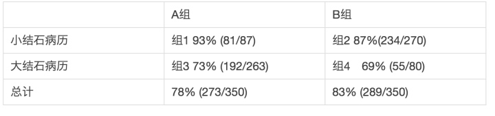
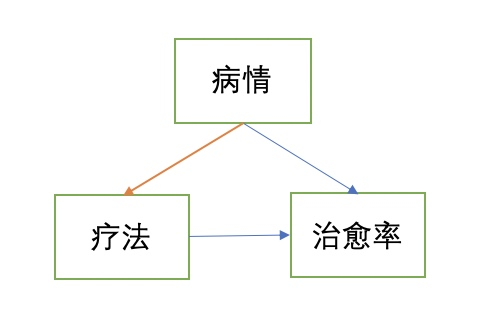
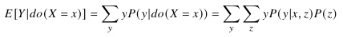
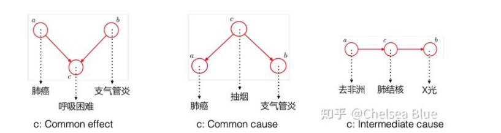

# 01. 因果推断导论

因果推断要解决的问题不是「两个变量有没有相关性」，而是：

> 如果我们主动改变某个因素，结果会不会因此改变？改变多少？

在业务里，这个问题通常表现为：

- 新策略上线后，指标变好了，是策略带来的，还是外部环境变化？
- 某功能用户留存更高，是功能有效，还是高质量用户更容易使用功能？
- 某市场上线活动后收入提升，是活动增量，还是本来就处于增长趋势？
- 某广告策略提升 ARPU，是长期收益，还是牺牲留存换来的短期收益？

## 1. 相关、干预、反事实

因果问题可以按 Pearl 的因果阶梯理解：

| 层级 | 问题 | 例子 |
|---|---|---|
| 关联 | 看到 X 时，Y 会怎样 | 使用功能的用户是否留存更高 |
| 干预 | 如果主动改变 X，Y 会怎样 | 给用户展示新功能会不会提升留存 |
| 反事实 | 如果同一个用户没接受处理，会怎样 | 这个用户如果没看到广告，会不会仍然付费 |

普通统计相关主要回答第一层；实验和因果推断关心第二、第三层。

## 2. 为什么相关不等于因果

相关性容易被三类因素污染：

| 问题 | 解释 | 例子 |
|---|---|---|
| 混杂 | 第三个变量同时影响处理和结果 | 高活用户更容易使用新功能，也天然更容易留存 |
| 选择偏差 | 进入处理组不是随机的 | 愿意参加活动的用户本来就更活跃 |
| 时序干扰 | 处理前后环境发生变化 | 策略上线同时赶上节假日或版本大促 |

因此，直接比较 treated 和 untreated 往往不是因果效应。

## 3. 因果推断和业务评估

业务里的因果推断通常是为了补齐 AB 实验覆盖不到的场景：

- 策略已经全量上线，没有对照组；
- 因合规、舆情、体验风险，不能随机分组；
- 按国家、城市、门店、版本分批上线，随机化粒度不够细；
- 用户是否接受 treatment 由自己选择，存在严重选择偏差；
- 需要评估长期影响，但实验期太短或已结束。

## 4. 本模块的核心问题

学习因果推断时，不应只记公式，而要围绕四个问题：

1. treatment 是什么？
2. outcome 是什么？
3. 反事实对照是什么？
4. 为什么这个反事实是可信的？

相关旧文档：

- [【TOC】因果分析](MOC_因果推断体系.md)
- [因果分析](01_因果推断导论.md)
- [【读书笔记】为什么：关于因果关系的新科学](09_资料_因果推断读书笔记与学习资源.md)

---

<!-- migrated-from: MOC_因果推断体系.md -->

## 旧笔记整合：因果分析 TOC、观察性研究与研究框架

> 迁移说明：原 TOC 内容较综合，先整体并入导论，后续可继续拆细。

# 一、概念探讨

## 因与果

休谟

[概念与研究框架_因果](04_潜在结果框架_ITE_ATE_ATT_CATE.md)

## 观察性研究能获取定量结论吗？
我们先来看看从观察性研究中获取定量结论可能会碰到哪些问题，比如：
> 场景1： 针对有无某个因素T={0,1} 研究其对目标变量Y的影响。我们想研究有无某个政策对经济的影响、有无某个策略后对公司业务的影响，

可能会出现在这个政策/策略因素T出现前后，其他因素有变化，导致我们无法客观评估；

> 场景2：举一个医学中辛普森悖论的例子：
在医疗实验中遇到下面一个情况：

比较两种疗法对于肾结石手术的效果，无论是对于小结石病例，还是对于大结石病例。都发现A比B好(纯治愈率上)。但是整体总计下来，A却比B的效果差。
最终发现是因为这两个组的实验病例选择有问题，都不具备代表性。因为医生认为病情重的适合A，病情轻的适合B。所以会看到A中大结石病例多，B中小结石病例多。即两组中样本并没有随机分配。

总结下，如果我们想通过观察性研究获得可靠的结论，需要解决或者关注如下几个问题：
1. 潜在的混杂变量：观察性研究中，我们无法控制或操纵自变量，因此可能存在一些未知的混杂变量对结果产生影响。
2. 选择性偏差：在观察性研究中，我们不能随机分配参与者到不同的处理组，而是根据他们自身的选择进行分组。这可能导致参与者之间存在一些差异，从而影响结论的准确性。
3. 信息偏倚/回忆偏倚：观察性研究中，数据收集通常依赖于被试者提供的信息或记录。这种信息可能是主观的、不准确的或有记忆偏差，从而影响结论的可靠性。或者由于记忆有限和遗忘现象，被试者可能无法准确地回顾过去发生的事情，从而影响结论的准确性。

综上所述，在观察性研究中获取定量结论存在一些困难和限制。然而，在一定程度上仍然可以通过统计方法和模型来控制混杂变量、纠正偏差并进行因果推断，从而得出定量结论。但相比于实验研究，观察性研究所得到的结论往往更具有推测性和相关性，需要更多的严谨性和谨慎解释。

![[../../../附件/Excalidraw/【TOC】因果分析 2023-08-04 13.42.32.excalidraw.md]]

# 二、研究框架

我们通过数据认知规律，而数据的存在形式会影响我们的研究方法。对于实验型数据，我们可以通过AB实验来获得客观的结论；对于实际场景中没有办法进行AB实验的观测型数据，则要通过因果分析的方式了。
- 实验研究
- 观察性研究

潜在结果框架和结构因果模型是因果分析领域的两种主要研究框架，它们在不同的背景和问题设置下被提出来。

> [!quote] 潜在结果框架最早由美国统计学家和经济学家Donald Rubin在20世纪70年代提出。该框架主要应用于实证研究中，通过观测数据来推断因果效应。潜在结果框架的核心思想是，每个个体在接受和未接受处理（干预）的情况下都存在两个潜在结果，通过比较这两个潜在结果的差异，可以推断出干预的因果效应。这个框架在实证研究中被广泛应用，特别是在医学、社会科学和政策评估等领域。

> [!quote] 结构因果模型则是源自于计算机科学和人工智能领域的因果推断方法。这个框架最早由美国计算机科学家Judea Pearl在20世纪80年代提出。Pearl提出了贝叶斯网络和因果图的概念，将因果关系表示为有向无环图，并使用概率分布来描述变量之间的条件概率关系。结构因果模型旨在通过构建因果关系图来解释和推断因果效应。这个框架在计算机科学、统计学和人工智能领域得到了广泛应用，尤其是在因果推断和因果关系建模方面。

这两种研究框架的提出是为了解决因果关系推断和解释的问题。潜在结果框架强调观测数据的比较，通过对个体的潜在结果进行推断。而结构因果模型则强调构建变量之间的因果关系图，通过对因果图进行分析和推断来解释因果效应。这两种框架在不同的研究领域和问题背景下有不同的应用和优势。

> prompt:
> 请帮我详细梳理因果分析中潜在结果框架中各个子方法的发展历程，请帮我按照时间顺序梳理，以markdown表格的形式输出，例如： | 方法提出时间 | 方法背景，解决问题场景 | 方法原理 | 方法局限 | |:-------|:------------|:-----|:-----| | xxx | PSM | | | | xxx | DID | | |

## 2.1 潜在结构框架

潜在结构框架下，按照处理的方式不同，可以分为如下几种方式：
-  Matching 方法
非常直观的想法，即将实验组和对照组中的个体进行matching打平，比如实验组中有个age=20-30，gender=‘女’，city=‘北京’的样本，那么就在对照组中找到一个和她属性一样或者类似的样本，这样就可比了。
	- CEM:  适用于离散情况，协变量不多且确定的情况
	- MDM:  高维的时候CEM就垮掉了，MDM不追求完全一致，而是按照‘距离’接近来定义。
	- PSM：倾向性匹配得分
	- 合成控制法：本质上也是匹配的思想。区别在于可以通过合成多个构造出来一个虚拟的对照组。

|   方法提出时间   |   方法背景，解决问题场景   |   方法原理                                                                                                                                           |   方法局限                                                                                                                           |
|:-----------|:----------------|:-------------------------------------------------------------------------------------------------------------------------------------------------|:---------------------------------------------------------------------------------------------------------------------------------|
|   CEM      |        1970年代   |   CEM（Covariate Matching）是匹配方法中最早出现的一种。它的提出是为了解决观察研究中的选择偏倚问题。CEM通过将处理组和对照组的个体按照协变量进行匹配，减小组间的观测差异，从而更准确地估计因果效应。                                   |   - CEM方法需要事先指定匹配的协变量，如果未能正确选择协变量，可能会导致匹配结果不准确。 - CEM方法对于高维数据的处理较为困难，需要进行维度约减或变量选择。 - CEM方法在处理不平衡数据时可能会出现匹配失败的情况。          |
|   MDM      |        1980年代   |   MDM（Mahalanobis distance matching）是一种基于距离的匹配方法                                                                                                 |   - MDM方法可以更准确地估计处理组和对照组之间的潜在结果差异，尤其在处理组和对照组之间存在较大差异的情况下。 - MDM方法对于高维数据的处理相对较好，不需要进行维度约减或变量选择。 - MDM方法在使用过程中需要计算两两pair的距离  |
|   PSM      |        1990年代   |   PSM（Propensity Score Matching）是一种基于倾向得分的匹配方法。它的提出是为了解决观察研究中的选择偏倚问题，并且通过倾向得分模型来估计处理组和对照组的概率分布。本质上相当于是一种降维方法                                     |   - PSM方法在匹配过程中可以灵活地选择匹配算法，如最近邻匹配、卡尺匹配等。 - PSM方法可以处理多个处理组和对照组的情况，适用于多组因果比较。 - PSM方法在倾向得分模型的建立过程中可能存在模型假设的问题，需要注意模型的合理性。    |  
| 2010  | 合成控制法（Synthetic Control Method） | 合成控制法是一种非参数方法，用于处理单个处理组的情况。该方法通过将多个对照组的信息合成，构建一个合成对照组，与处理组进行比较来推断因果效应。 | 合成控制法对于对照组的选择和合成的假设敏感，需要满足这些假设才能准确推断因果效应。 | Alberto Abadie and Alexis Diamond |

请注意，上述表格中的发展历程是根据大致的时间顺序进行梳理的，具体的时间节点可能略有偏差。此外，方法的背景、原理和局限性也是简要总结，并非详尽无遗。

除此之外，针对时序数据还有如下的几种方式：

| 方法提出时间 | 方法背景，解决问题场景 | 方法原理 | 方法局限 | 提出的作者或研究机构 |
|:-------|:------------|:-----|:-----|:-------------------|
| 1999  | 双重差分（Difference in Differences） | 双重差分是潜在结果框架中另一种常用的方法，通过比较接受处理和未接受处理组别在时间上的差异，来推断因果效应。双重差分可以消除个体固定效应和时间固定效应的影响。 | 双重差分方法对于处理组和对照组的平行趋势假设敏感，需要满足平行趋势假设才能准确推断因果效应。 | Alberto Abadie and Joshua Angrist |
| 2004  | 差分中断时间法（Difference-in-Differences with Interrupted Time Series） | 差分中断时间法是双重差分方法的扩展，适用于处理组和对照组在某个时间点发生干预的情况。通过比较干预前后的差异，来推断因果效应。 | 差分中断时间法对于干预效果的持续时间和趋势的假设敏感，需要满足这些假设才能准确推断因果效应。 | Alberto Abadie |
| 2008  | 仪器变量法（Instrumental Variables） | 仪器变量法是潜在结果框架中的另一种常用方法，用于解决内生性问题。该方法利用一个或多个仪器变量来代替自变量，从而消除内生性问题，推断因果效应。 | 仪器变量法对于仪器变量的选择和有效性有严格要求，需要满足一些仪器变量的假设。 | Joshua Angrist and Alan Krueger |

## 2.2 结构因果模型框架
结构因果模型是一种用于分析因果关系的统计模型。它基于因果图的概念，通过描述变量之间的依赖关系和因果关系来推断因果效应。以下是结构因果模型的框架：

1. 变量：结构因果模型中的变量可以分为两类：观察变量和潜在变量。观察变量是我们直接观察到的变量，而潜在变量是未直接观察到的变量，需要通过其他变量进行推断。
    
2. 因果图：结构因果模型使用因果图来表示变量之间的依赖关系和因果关系。因果图由节点和有向边组成，每个节点代表一个变量，有向边表示变量之间的因果关系。
    
3. 条件独立性：结构因果模型假设变量之间的关系可以通过条件独立性来描述。条件独立性是指在给定一些其他变量的条件下，两个变量之间不存在直接依赖关系。
    
4. 参数估计：结构因果模型需要通过观察数据来估计模型的参数。参数估计的方法可以使用最大似然估计、贝叶斯估计等统计方法。

5. 因果效应：结构因果模型可以用来估计变量之间的因果效应。因果效应是指一个变量的变化对另一个变量的影响程度。通过结构因果模型，可以推断出一个变量对另一个变量的因果效应，并进行因果推断。
    
6. 可辨识性：结构因果模型中的可辨识性是指通过观察数据可以唯一确定模型的参数和结构。可辨识性是结构因果模型的一个重要性质，保证了模型的一致性和可靠性。
    
7. 因果推断：结构因果模型可以用来进行因果推断，即通过模型估计得到的因果效应，推断出变量之间的因果关系。因果推断可以帮助我们理解和解释现象，并指导决策和干预措施。

# 三、实践

> [!failure]- Failure 
>   Error: There is another generation process
>   
>   - plugin:obsidian-textgenerator-plugin:56986 TextGenerator.eval
>     plugin:obsidian-textgenerator-plugin:56986:31
>   
>   - Generator.next
>   
>   - plugin:obsidian-textgenerator-plugin:78 eval
>     plugin:obsidian-textgenerator-plugin:78:61
>   
>   - new Promise
>   
>   - plugin:obsidian-textgenerator-plugin:62 __async
>     plugin:obsidian-textgenerator-plugin:62:10
>   
>   - plugin:obsidian-textgenerator-plugin:56972 TextGenerator.generate
>     plugin:obsidian-textgenerator-plugin:56972:12
>   
>   - plugin:obsidian-textgenerator-plugin:58477 AutoSuggest.eval
>     plugin:obsidian-textgenerator-plugin:58477:52
>   
>   - Generator.next
>   
>   - plugin:obsidian-textgenerator-plugin:78 eval
>     plugin:obsidian-textgenerator-plugin:78:61
>   
>   - new Promise
>   
>

---

<!-- migrated-from: 01_因果推断导论.md -->

## 旧笔记整合：因果分析总览、Causal AI 与业务案例

> 迁移说明：保留原有辛普森悖论、Pearl、Causal AI、快手案例等内容。

首先关于因果分析，并没有一个明确的定义。哲学中对因果关系的讨论，将其划分成了如下两类
- Type causality： 关注某个原因会导致什么结果，比如吸烟是否会导致肺癌？ 由因推果
- Actual causality: 关注某个结果发生的具体原因是什么。比如恐龙灭亡的原因是六千万年的小行星撞地球导致的吗？由果推因

## 1.统计领域的因果推断
场景: 在现实世界中我们会有大量的数据，我们希望从若干变量的一堆数据中提取出他们之间的因果关系，这时候要做的事情就是因果推断.

Pearl在《为什么》中指出因果关系之梯。
1. 关联
2. 干预
3. 反事实

统计模型只有关联层的信息，所以只能回答相关性问题，而不能回答干预问题和反事实问题。基于图的因果贝叶斯网络只有干预层的信息，所以只能回答干预和关联层的问题，而不能回答反事实问题。最后基于结构的因果模型，它的能力最接近物理模型，用函数关系表示原因和结果之间的关系，三个层级的问题都能够回答。

当下的因果建模主要有两个框架
**(1) Potential Outcome Framework ——实验主义因果**

设想一种与观测数据相悖的情况，比如对比用药与不用药的结果，因此也被成为experimental causality。

经常会碰到的一个辛普森悖论的问题：比如如下这么个数据

比较两种疗法对于肾结石手术的效果，无论是对于小结石病例，还是对于大结石病例。都发现A比B好(纯治愈率上)。但是整体总计下来，A却比B的效果差。
最终发现是因为这两个组的实验病例选择有问题，都不具备代表性。因为医生认为病情重的适合A，病情轻的适合B。所以会看到A中大结石病例多，B中小结石病例多。即两组中样本并没有随机分配。
换句话说，这个背后的实际情况是：

所以严格意义上的实验，应该切断病情与疗法的选择。两边病情的分布是一致的

Pearl提出的Do-calculus方法计算x对Y的影响如下:

**(2) Judea Pearl 的结构因果模型(SCM)**

SCM包括三个部分: 图模型、结构方程、反事实和干预逻辑。

## 2.casual AI
当前有很多最优秀的科学家在朝着这个方向努力，其中三个代表性研究工作者是:

- UCLA 教授 Judea Pearl 
- 马普智能所所长 Bernhard Schölkopf，《CAUSALITY FOR MACHINE LEARNING》综述，2017
- Mila 所长 Yoshua Bengio。https://yoshuabengio.org/research/

简单来说 Judea Pearl 是 Causal AI 的奠基人，Bernhard Schölkopf 等人推进了 Causality for Machine Learning，Yoshua Bengio 最近提出了 System 2 deep learning 作为 Causal AI 的一个范式。

## 理论方法

计量经济学-格兰杰因果检验
2012 年 Science 论文 收敛交叉映射算法

## 2. causal discovery

## 案例1.快手-因果分析

（1）计量经济方法
- 工具变量

$y=X\beta +e$ 但是cov(Xe)≠0
Z -> x -> y
e-> x, e->y

因为现实中可能存在未知的因素e，其影响x，同时影响y，所以不一定是x=> y. 解决这种问题的办法就是寻找外生变量满足
cov(Z, X) 有相关性， cov(Z,e)

2SLS: 先用Z对X进行拟合，得到$\hat X$, 然后对Y使用$\hat X$进行回归

比如Z代表一个实验，与要研究的X香相关，

- 双重差分法

政策干预发生与否的虚拟变量 + 前后两个时间段的面板数据 + 不可观测的个体固定效应
- 匹配法
比如上限的某个功能渗透率较低，很可能对比实验和对照没有信号。而使用该功能的人其实可能会有一定的特性偏差，所以匹配法，就是用分类模型，预测实验和对照中的搞概率的人，然后选择这部分人进行比较

-合成控制法
比如针对地区做实验，实验组在A城市进行，对照组无法找一个和A完全一样的城市，就通过合成的方法，找其他几个城市，然后确定权重。

(2) AB test

(3) 机器学习的方法

矩阵补全法: app更新版本后，用户实际更新的时间是不同的。矩阵补全的方式是设法将数据进行拉齐吧

(4)复杂实验设计——双边网络实验

比如: 直播: 主播和观众，电商:卖家和买家

|  | 策略展现 | 策略不展现 |
| --- | --- | --- |
|  实验组 |Y  |N2  |
|  对照组组 |N1  |N3  |

----
参考资料:
https://zhuanlan.zhihu.com/p/166234159
https://zhuanlan.zhihu.com/p/33860572
图领奖得住-铂尔《为什么》
https://zhuanlan.zhihu.com/p/96001507

因果分析的最新研究方向: https://zhuanlan.zhihu.com/p/119248355

《为什么》读书笔记 https://zhuanlan.zhihu.com/p/75141475

https://giters.com/causal-machine-learning/kdd2021-tutorial?amp=1
