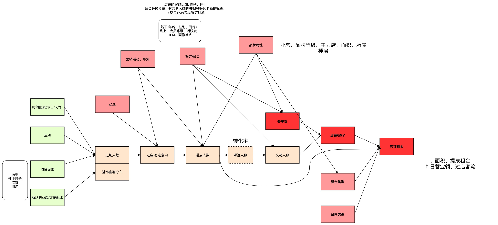

# 03. 无实验场景效果评估决策树

这篇用于业务评估时快速选择方法。

## 1. 先判断能不能随机化

```text
能随机分组？
  ├─ 能：优先 AB 实验
  └─ 不能：判断为什么不能随机
```

不能随机常见原因：

- 策略已经全量上线；
- 只能按国家、城市、门店、版本分批上线；
- 存在舆情、体验、商业风险，不能刻意不让部分用户使用；
- treatment 由用户自己选择，不能强制分配；
- 样本单元之间会相互影响，随机化被干扰。

## 2. 方法选择表

| 问题形态 | 优先方法 | 判断要点 |
|---|---|---|
| 有处理前后，也有未处理对照组 | DID | 处理前趋势是否平行 |
| 单个市场/城市/国家/业务单元被处理 | 合成控制法 | 能否用多个未处理单元合成处理前走势 |
| 处理组和对照组可观测特征不平衡 | Matching / PSM | 可观测变量是否足以解释选择机制 |
| treatment 与未观测因素相关 | IV | 是否有只影响 treatment、不直接影响 outcome 的外生变量 |
| treatment 由阈值触发 | RDD | 阈值附近是否近似随机 |
| 关注不同人群增量收益 | CATE / Uplift | 是否有可靠实验或准实验数据支撑模型训练 |
| 存在用户间、供需两侧相互影响 | 溢出效应 / 网络实验 | SUTVA 是否被破坏 |

## 3. 业务场景示例

| 业务问题 | 推荐路径 |
|---|---|
| 某广告变现策略已全量上线，想补评估收益 | 先看是否有上线前后和未上线市场：DID；如果只有一个上线市场：合成控制 |
| 新功能只被一部分用户主动使用，使用者留存更高 | 先排查选择偏差：Matching / PSM，再做敏感性分析 |
| 某版本分批覆盖不同国家，想评估收入提升 | DID / staggered DID / 合成控制 |
| 平台根据分数线给用户发权益 | RDD |
| 想判断哪些用户被触达后真正有增量 | CATE / Uplift |

## 4. 选择方法时的底线

不要先选方法再找理由。顺序应该是：

```text
业务机制 -> 数据生成过程 -> 识别假设 -> 方法选择 -> 稳健性检验
```

如果识别假设讲不清，模型再复杂也不能产生可信因果结论。

相关方法：

- [方法_Matching与PSM](方法_Matching与PSM.md)
- [方法_DID双重差分](方法_DID双重差分.md)
- [方法_IV工具变量](方法_IV工具变量.md)
- [方法_合成控制法](方法_合成控制法.md)
- [方法_RDD断点回归](方法_RDD断点回归.md)
- [方法_异质性处理效应与Uplift](方法_异质性处理效应与Uplift.md)


---

<!-- migrated-from: 03_无实验场景效果评估决策树.md -->

## 旧笔记整合：因果效应估计方法总览

> 迁移说明：原文中的 regression adjustment、PSM、IV、深度学习表征等作为方法总览保留。

## 实际操作
按照是否支持有unobserved confounder

1. 要求无unobserved confounder


###  regression adjustment
建立有监督模型 Y=f(X, treat)
从而可以计算出$p(y_i|t=1, X_i) - p(y_i| t=0, X_i)$

这个方法非常简单，他在uplift模型（估计ITE）中也叫S-learner

### PSM
propensity score method，这类方法核心还是一种matching的逻辑，想想如果我们有做实验的条件，我们的做法是不是去做一个随机对照实验(RCT)，也就是基于样本的特征去给他们分组然后控制变量。这就是一种最朴素的matching的逻辑


2. 不要求no unobserved confounder的方法

### IV


### 深度学习表征


## 1. 随机分组

此时有 ATE=ATT

## 2. 假设个体依据可测变量选择是否参加——匹配估计

匹配估计的基本思路：
对处理组或者对照组中的每个个体，在可测变量x维度上，去另外一个组去找相似的个体。 然后认为y_i-y_j是个人i的处理效应。最后将每个个体的处理效应进行平均，即可得到**匹配估计量**


## 3. 假设个体依据不可测变量选择是否参加


## 参考资料
- https://zhuanlan.zhihu.com/p/397974913
- DMC
-


---

<!-- migrated-from: 03_无实验场景效果评估决策树.md -->

## 旧笔记整合：RDD、IV、PSM、DID 方法草稿

> 迁移说明：原方法篇篇幅较短，作为方法选择补充保留。

评估：
因果推断也好，AB-test也好，都是为了研究某个因素是否影响另一个的。实际场景中如果没办法进行ab-test可以尝试进行因果推断。
- ab测试
- 观察研究


## 分析逻辑


## bak

### 断点回归RDD

基本方法：只取断点附近的数据进行分析。
比如前面研究是否上大学与income的关系，一般来说上大学的能力要比不上大学的能力强，此外还可能存在其他的差别因素。如果我们按照分数进行筛选，比如分数线是400，那么400上下的人能力水平应该是差不多的，比如350-400，400-450的两组人，可以进行分析对比，t-test

比如：研究大屏对商场中消费者的吸引程度。通过划分区域和停留时长，认为构造出两个相似的人群。


### IV 工具变量
研究X->Y, 但是Z是混杂因子，可以找另一个变量T，T与Y,Z不相关，与X强相关。

从因果图上看是阻断

从回归模型看，其实是解决了X与Z之前贡献相关的问题


两阶段回归


### PSM


PS就是以干预因素（组别）为因变量，以所有观测到的非研究性因素为自变量进行logistic或probit回归. 得到倾向性得分

1.  同时影响干预分配和结果的变量应该被包括（使CIA成立）
2.  被干预项影响的变量应该排除（变量需要在干预项前计算）


匹配算法：**为每个被干预的样本匹配一个（或多个）虚拟的对照样本**。
https://zhuanlan.zhihu.com/p/491179790

(1) 最近邻匹配
对干预组中的用户，选取在对照组中倾向性


### DID


## 自己的实践案例


过程漏斗实际是受到
- 品牌因素
- 场地动线、布局因素
- 客群属性因素
- 营销活动因素
等等的印象
