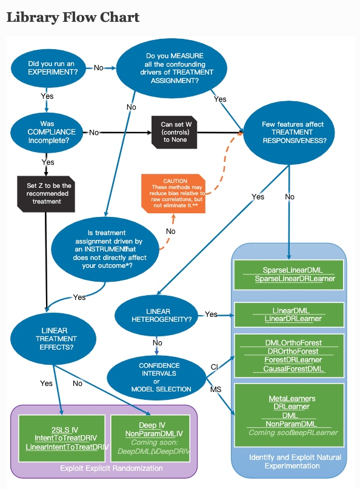

# 08. 工具：EconML 与 CausalML

EconML 和 CausalML 更偏向机器学习因果效应估计，尤其适合 CATE / Uplift。

## 1. 工具定位

| 工具 | 重点 |
|---|---|
| EconML | DML、DRLearner、CausalForest、IV、CATE 估计 |
| CausalML | Uplift modeling、S/T/X learner、tree-based uplift |
| DoWhy | 因果问题建模、识别、估计、反驳流程 |

## 2. 适用场景

- 需要估计异质性处理效应；
- 需要回答哪些人群增量更高；
- 需要从实验数据中训练 uplift 策略；
- 需要和机器学习模型结合，但仍保留因果解释。

## 3. 注意事项

机器学习因果模型不能自动消除偏差。

如果 treatment 分配机制本身不可信，CATE 模型会把选择偏差学进去。

因此建模前仍要先判断：

- treatment 是否随机或准随机；
- 是否有足够的控制变量；
- 是否满足 overlap；
- 是否需要先做 Matching / IPW / DR 修正。

## 4. 原始资料

旧文档保留了工具链接和示意图：

- [工具-econML&causalML](08_工具_EconML与CausalML.md)
- [uplift](../方法_异质性处理效应与Uplift.md)

---

<!-- migrated-from: 08_工具_EconML与CausalML.md -->

## 旧笔记整合：EconML 与 CausalML 工具对比

> 迁移说明：保留原工具对比和链接。

# econML

一个简单的对比

| 工具 | 说明| 估计方法 |
| --- | --- | --- |
| dowhy | 微软-4步骤框架 | 比较基础，涵盖的的是psm、psm、psw、iv等 |
| econML | 微软 |  DML、uplift model、IV、Doubly Robust等|
| CausalML | uber 主要面向Uplift模型 | uplift model，S-learner 、 T-learner、X-learner、DR等,Tree-based 算是多出的，还有几款NN-Based的 |

解释性，econml / causalml款都有，涵盖shap / Tree Interpreter /Policy Interpreter

## econML

https://github.com/microsoft/econml
使用文档说明： https://econml.azurewebsites.net/
econML 是 ALICE project 的一部分。

任务执行流程

## CausalML
https://github.com/uber/causalml
主要是针对uplift model和ML类的
