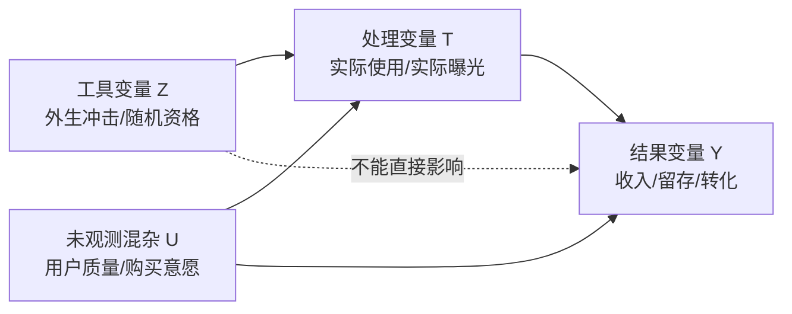

工具变量用于处理内生性问题。

## 1. 内生性是什么

当 treatment 与未观测因素相关时，直接回归会有偏。例如：

```text
用户看到更多广告 -> 收入变化
```

但高价值用户可能本来就被系统分配了更多广告，也天然更容易产生收入。此时广告曝光与未观测用户价值相关，存在内生性。

## 2. 工具变量需要满足三个条件

| 条件 | 含义 |
|---|---|
| 相关性 | 工具变量 $Z$ 会影响 treatment $T$ |
| 排除限制 | $Z$ 只能通过 $T$ 影响 outcome $Y$ |
| 独立性 | $Z$ 与影响 $Y$ 的未观测混杂无关 |

图示：



$Z$ 用来提取 treatment 中外生变化的部分。也就是说，$T$ 里既有受用户质量等混杂因素影响的部分，也有由 $Z$ 带来的外生变化；IV 只用后者来估计 $T$ 对 $Y$ 的影响。

## 3. 两阶段最小二乘 2SLS

第一阶段：

$$
T = \pi_0 + \pi_1 Z + \pi_2 X + v
$$

得到预测的 treatment：$\hat T$。

第二阶段：

$$
Y = \alpha + \beta \hat T + \gamma X + \epsilon
$$

$\beta$ 是 IV 估计的因果效应。它不是直接用原始 $T$ 回归 $Y$，而是用第一阶段中由工具变量 $Z$ 预测出来的 $\hat T$，从而尽量剔除 $T$ 中和未观测混杂相关的部分。

## 4. 一个具体例子：估计“实际使用新功能”对留存的影响

假设要评估：用户实际使用新手引导功能 $T$，是否会提升 7 日留存 $Y$。

直接比较“使用过新手引导的人”和“没使用过的人”会有偏，因为更活跃、更愿意探索的用户本来就更可能使用新功能，也更容易留存。这里的未观测活跃意愿就是混杂 $U$。

可以设计一个工具变量 $Z$：

```text
Z = 是否随机获得首页入口强化曝光资格
T = 用户是否实际使用新手引导功能
Y = 7 日留存
```

如果这个入口强化曝光是随机分配的，并且它只通过提高“实际使用新手引导”的概率来影响留存，那么它可以作为 IV。

两阶段解释：

1. **第一阶段**：用随机入口资格 $Z$ 预测用户是否实际使用功能 $T$；
2. **第二阶段**：用预测出来的使用概率 $\hat T$ 解释 7 日留存 $Y$。

直觉上，IV 回答的是：

> 那些因为随机入口曝光而多出来的功能使用，对留存带来了多少增量？

这通常估计的是 **LATE**，也就是“被工具变量影响而改变行为的人群”的局部平均处理效应，不一定等于全体用户的平均效果。

## 5. 业务中可能的工具变量

| 场景 | 可能的 IV | 风险 |
|---|---|---|
| 分批上线 | 上线批次、灰度资格 | 批次可能和市场质量相关 |
| 距离/可达性 | 离某资源的距离 | 距离可能直接影响 outcome |
| 系统规则 | 随机阈值、排队顺序 | 规则是否真外生 |
| 外部冲击 | 政策、天气、供给波动 | 是否只通过 treatment 影响结果 |

## 6. 常见误用

- 只证明 $Z$ 和 $T$ 相关，却没有论证排除限制；
- 工具变量太弱，第一阶段解释力不足；
- 工具变量本身直接影响 outcome；
- 对 IV 估计结果解释过度，忽略它通常估计的是 LATE。

## 7. 相关旧文档

- [Part2 方法篇](03_无实验场景效果评估决策树.md)
- [因果分析](01_因果推断导论.md)
- [因果效应估计方法](03_无实验场景效果评估决策树.md)
