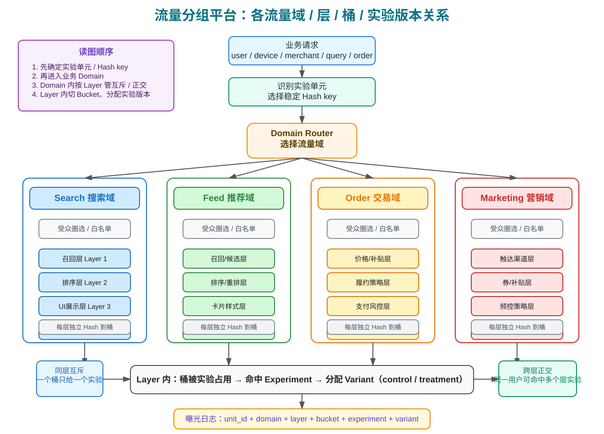

抽样平台负责把实验方案落到稳定、随机、可追踪、可复现的线上流量分组上。它是实验可信度的基础设施。

如果要设计一个线上抽样 / 分流平台，它需要支撑多个业务、多个实验长期并行运行，同时保证随机、互斥、正交、可追踪、可回滚。

一句话：**抽样平台要保证实验组和对照组除了实验处理不同，其他方面尽量随机一致**。

## 1. 抽样平台要解决的问题

流量分层与正交设计后，线上实验流量平台本质是一个：

```text
稳定分桶 + 流量治理 + 配置下发 + 命中记录 + 质量监控
```

它要解决：

- 同一个用户每次访问都稳定命中同一实验版本；
- 多个实验可以长期并行；
- 互斥实验不能同时作用到同一用户；
- 正交实验可以复用流量；
- 可以按人群、场景、端、地域、版本、时间圈选；
- 实验上线后能追踪用户命中了哪个实验、哪个版本、哪个参数；
- 支持空转、小流量、灰度、扩量、暂停、回滚、全量。

## 2. 抽样基础

### 2.1 抽样方式

| 类型 | 方法 | 说明 |
|---|---|---|
| 非随机抽样 | 随意抽样、判断抽样、定额抽样、捕获-标记-再捕获 | 适合调查或特殊总体，不适合强因果实验 |
| 随机抽样 | 简单随机、分层抽样、系统抽样、整群抽样、多阶段抽样 | 实验设计优先使用，支撑因果推断 |

线上 AB 的核心是随机抽样 / 随机分桶；如果人群异质性很强，可先分层再随机。

### 2.2 Hash 流量切分

线上小流量实验常把流量切成很多份，例如 0~9999 共 10000 个桶：

```text
bucket = hash(layer_id + salt + unit_id) % 10000
```

如果 hash 足够随机，要抽 1% 流量，只需要选择 100 个桶。

设计要点：

- `layer_id` 保证不同层之间重新随机，形成正交；
- `salt` / `experiment_salt` 防止不同实验复用同一随机序列；如果没有 salt，那么同一个用户在同一个 layer 里永远落到同一个桶，灵活性太低。
- `unit_id` 实验的分组id，比如用户user_id，device_id；
- `bucket_num` 建议足够细，如 1000、10000，方便小流量和逐步扩量。

## 3. 先选实验单元，再选分桶键

分桶键不是随便选一个 ID，而是由实验单元决定。更准确地说，线上实验要尽量让三件事保持一致：

```text
实验单元 = 随机分组单元 = 指标统计单元
```

如果三者不一致，就容易出现体验不稳定、组间污染、统计口径不清等问题。

### 3.1 选择分桶键的判断顺序

可以按下面顺序判断：

```text
1. 实验真正改变的是谁的体验？
   ↓
2. 这个对象是否需要跨请求保持稳定？
   ↓
3. 核心指标最终按哪个对象聚合？
   ↓
4. 是否存在同一对象命中多个版本的风险？
   ↓
5. 选择最稳定、最贴近实验对象的 Hash key
```

举例：

- 改用户端页面文案：体验对象是用户，优先 `user_id`；
- 改商家补贴策略：权益对象是商家，优先 `merchant_id`；
- 改搜索排序：如果要稳定用户体验，优先 `user_id`；如果只比较 query 级排序效果，可考虑 `query` 或 request 级机制；
- 改履约订单策略：如果同一用户多笔订单可以有不同处理，可能按 `order_id`；如果要保持用户体验一致，仍要考虑 `user_id`。

### 3.2 常见 Hash key 对比

| Hash key | 适用场景 | 优点 | 风险 |
|---|---|---|---|
| user_id | 登录用户体验、转化、留存实验 | 用户长期稳定，便于指标归因 | 未登录用户覆盖不足 |
| device_id / cookie_id | 未登录场景、轻量体验实验 | 覆盖未登录流量 | 清缓存、换设备会跳组 |
| merchant_id / shop_id | 商家策略、B 端权益、商家排序 | 商家维度稳定 | 商家之间可能互相影响 |
| item_id / content_id | 内容、商品维度策略 | 适合验证内容侧干预 | 同一用户会看到多个版本，用户体验可能混杂 |
| order_id | 订单履约、订单风控 | 每笔订单独立处理 | 同一用户多订单体验不一致 |
| query | 搜索 query 级排序实验 | 同一 query 稳定，适合排序局部比较 | 同一用户不同 query 体验不同 |
| request_id / qid | 请求级随机、interleaving | 敏感、流量利用率高 | 不适合长期体验类实验 |

原则：**分桶键要和实验单元一致；如果不一致，必须在实验方案里说明为什么可以接受。**

### 3.3 常见反例

| 反例 | 问题 |
|---|---|
| 用户体验实验按 request_id 分桶 | 同一用户一会儿看到 A，一会儿看到 B，体验污染 |
| 商家补贴实验按 user_id 分桶 | 同一商家面对不同用户策略不同，商家侧效果难归因 |
| 低频转化实验按过细粒度分桶 | 样本分散，指标方差大，实验不敏感 |
| 已登录和未登录使用不同分桶规则但混在一起分析 | 两组人群结构可能不一致，破坏可比性 |

## 4. 域、层、桶、实验、版本：五级流量抽象

选好分桶键之后，平台要解决的是：**这份流量进入哪个业务空间、在哪一层分配、占哪些桶、命中哪个实验、最终看到哪个版本。**

这可以拆成五级抽象：

```
流量域 Domain: 定义一类业务流量
  └── 流量层 Layer: Domain 内部的一层实验空间
        └── 分桶 Bucket
```

| 层级 | 核心问题 | 作用 | 例子 |
|---|---|---|---|
| Domain 实验域 | 这是哪类业务流量？ | 隔离业务空间，避免无关业务互相影响 | Search、Feed、Order、Marketing |
| Layer 流量层 | 哪些实验可以共享流量，哪些必须互斥？ | 管理互斥和正交关系 | 搜索召回层、排序层、UI 层、Holdout 层 |
| Bucket 桶 | 这一层流量如何切成可分配的最小份额？ | 支持小流量、扩量、回收 | 0~9999 共 10000 个桶 |
| Experiment 实验 | 哪个实验占用了哪些桶？ | 表达一次策略验证 | 排序模型 v2 实验、下单页文案实验 |
| Variant 版本 | 命中实验后看到哪个方案？ | 对照组 / 实验组分配 | control、treatment_A、treatment_B |

### 4.1 整体架构图

下面这张图按“实验单元 → 流量域 → 流量层 → 桶 → 实验版本 → 曝光日志”的顺序展示。网页里使用 SVG 展示，Obsidian 里也可以打开 Excalidraw 源文件继续编辑。



Excalidraw 源文件：[[流量分组_各流量域架构.excalidraw]]

### 4.2 一个请求如何命中实验

典型链路是：

```text
用户请求
  → 识别实验单元：例如 user_id
  → 识别实验域：例如 Search
  → 判断是否满足受众条件：端、地域、版本、白名单等
  → 进入 Search 域下的多个 Layer
  → 每个 Layer 独立 hash 分桶
  → 判断桶是否被某个实验占用
  → 命中实验后分配 control / treatment
  → 返回实验参数
  → 记录曝光日志
```

这里最容易混淆的是 Domain 和 Layer：

- **Domain 解决业务隔离**：搜索实验通常不应该占用交易域流量；
- **Layer 解决并行实验关系**：同一个搜索域里，排序实验和 UI 实验是否可以同时命中，就靠 Layer 管理。

## 5. 正交与互斥：用 Layer 表达实验之间的关系

流量分层的核心不是“多建几个层”，而是把实验关系表达清楚：**哪些实验不能同时命中，哪些实验可以同时命中。**

### 5.1 四种关系

| 关系 | 用户是否可同时命中？ | 平台实现 | 适用场景 |
|---|---:|---|---|
| 同层互斥 | 否 | 一个 Layer 内，桶只能被一个实验占用 | 两个搜索排序实验、两个价格策略实验 |
| 跨层正交 | 是 | 不同 Layer 独立 hash，同一用户可在多层分别命中实验 | 排序实验 + UI 实验、推荐策略 + 样式实验 |
| 父子实验 | 有条件 | 子实验只在父实验某个版本内运行 | 策略包内部再迭代、黑白盒实验 |
| 隔离域 / Holdout | 通常否 | 某类实验独占一个域、人群或长期保留桶 | 高风险策略、核心交易链路、长期基线 |

### 5.2 判断是否互斥的逻辑

如果一个新实验要上线，先问四个问题：

```text
1. 是否改同一个用户体验？
2. 是否影响同一个核心指标？
3. 是否存在策略依赖或工程依赖？
4. 是否会让结果归因不清？
```

| 判断结果 | 建议放置方式 |
|---|---|
| 明显互相影响 | 放同一 Layer，互斥分桶 |
| 弱相关但可能有交互 | 放不同 Layer，正交运行，分析时检查交互项 |
| 一个实验依赖另一个实验版本 | 做父子实验，只在父实验特定版本内分流 |
| 风险极高或要长期保留基线 | 单独 Domain / Holdout 层隔离 |

### 5.3 例子：搜索域怎么分层

```text
Search Domain
├─ Layer 1：召回层
│  ├─ 实验 A：召回策略 v2
│  └─ 实验 B：召回过滤规则优化
│  同层互斥：A 和 B 不应同时影响同一次搜索召回
│
├─ Layer 2：排序层
│  ├─ 实验 C：精排模型 v3
│  └─ 实验 D：特征权重调整
│  同层互斥：C 和 D 不应混在一起归因
│
├─ Layer 3：UI 展示层
│  ├─ 实验 E：新摘要样式
│  └─ 实验 F：按钮文案
│  可与排序层正交：同一用户可以同时命中排序实验和 UI 实验
│
└─ Layer 4：Holdout / 贯穿层
   └─ 实验 G：长期旧策略保留桶
   用于验证全量上线后的长期收益
```

这样设计后：

- 两个排序实验彼此互斥，避免归因不清；
- 排序实验和 UI 实验可以复用流量，提高实验效率；
- Holdout 层保留长期基线，方便全量后反转观察；
- 曝光日志里同时记录 domain、layer、experiment、variant，后续分析可以还原每个用户到底经历了哪些实验。

## 6. 线上抽样平台模块

| 模块 | 关键能力 | 设计要点 |
|---|---|---|
| 实验配置中心 | 创建实验、配置版本、分配流量 | 配置版本化，支持审批和回滚 |
| 分流引擎 | 实时判断用户命中哪个版本 | 高并发、低延迟、稳定 hash |
| 受众圈选 | 按属性、行为、端、地域、版本过滤 | 圈选条件必须在各组一致可观测 |
| 流量层管理 | 管理域、层、桶、占用关系 | 可视化冲突、剩余流量、互斥关系 |
| 参数下发 | 返回实验参数或策略开关 | 参数有默认值，失败回退 control |
| 曝光日志 | 记录实际命中和曝光 | 分析应基于实际曝光/触发 |
| 监控告警 | 检查流量、指标、数据质量 | SRM、分桶均匀性、护栏异常 |
| 分析报表 | 输出实验效果 | 指标、涨跌幅、置信区间、分层分析 |

## 7. 关键数据表

| 表 | 关键字段 |
|---|---|
| experiment_config | experiment_id、domain、layer、status、owner、start_time、end_time、traffic_ratio |
| variant_config | experiment_id、variant_id、variant_name、is_control、traffic_ratio、params |
| layer_bucket_map | domain、layer_id、bucket_id、experiment_id、occupied_status |
| audience_rule | experiment_id、rule_type、rule_config、version |
| exposure_log | unit_id、experiment_id、variant_id、bucket_id、request_id、exposure_time、scene |
| metric_dataset | experiment_id、unit_id、variant_id、metric_name、metric_value、date |
| experiment_decision | experiment_id、decision、reason、risk、operator、decision_time |

## 8. 业务化设计模板：搜索实验分流平台

如果设计一个搜索实验分流平台，可以按域和层拆分：

```text
Domain: Search
Layer 1: 召回层实验，互斥搜索召回相关策略
Layer 2: 粗排 / 精排层实验，互斥排序模型相关策略
Layer 3: UI 展示层实验，互斥卡片样式、摘要、按钮等 UI 实验
Layer 4: 贯穿层 / Holdout 层，用于长期保留基线流量
```

常见判断：

- 排序模型 A/B 和另一个排序模型实验：同层互斥；
- 排序模型实验和搜索结果页 UI 实验：可跨层正交；
- 多个算法策略都要合并上线时：可以打包到贯穿层做长期验证；
- 对全量上线策略：保留小流量反转 / holdout，观察长期效果。

## 9. 平台质量检查

上线前：

- 实验是否选对 domain 和 layer；
- 同层是否有流量冲突；
- 受众条件是否会导致两组不可比；
- 指标口径和数据集是否确认；
- control 默认参数是否可回退。

运行中：

- 流量是否按配置比例进入；
- 是否出现 SRM；
- 错误率、延迟、崩溃率是否异常；
- 曝光日志和业务日志是否能 join；
- 护栏指标是否异常。

分析前：

- 先看 SRM 和数据完整性；
- 再看核心指标；
- 最后看分层、长期效果和业务解释。

## 10. 参考资料

- Google Research：Overlapping Experiment Infrastructure: More, Better, Faster Experimentation，https://research.google.com/pubs/pub36500.html
- 得物技术：得物 AB 实验平台数据驱动决策实践，https://tech.dewu.com/article?id=122
- 火山引擎 DataTester 文档：实验层、互斥层、哈希桶相关说明，https://docs.volcengine.com/
- 阿里妈妈数据科学系列：在线分流框架下的 AB Test，https://zhuanlan.zhihu.com/
- 腾讯搜索实验经验整理：AB实验「坑」贼多？腾讯搜索实验有妙招，https://hub.baai.ac.cn/view/34886


下一步进入：[04_实验指标设计](04_实验指标设计.md)。
