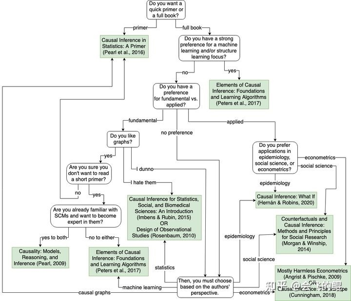

#toread 

[https://github.com/xieliaing/CausalInferenceIntro/blob/main/chapters/01%20%E7%AC%AC%E4%B8%80%E7%AB%A0-%E5%9B%A0%E6%9E%9C%E5%85%B3%E7%B3%BB%E5%85%A5%E9%97%A8.ipynb](https://github.com/xieliaing/CausalInferenceIntro/blob/main/chapters/01%20%E7%AC%AC%E4%B8%80%E7%AB%A0-%E5%9B%A0%E6%9E%9C%E5%85%B3%E7%B3%BB%E5%85%A5%E9%97%A8.ipynb)

[Causal Inference for the Brave and True](https://zenodo.org/badge/latestdoi/255903310)

# 课程

Brady Neal 因果推断导论，B站也有
https://www.bradyneal.com/causal-inference-course

# reading

# tools
https://zhuanlan.zhihu.com/p/405226148

- causalml
https://github.com/uber/causalml
- dowhy
- econMl
https://github.com/microsoft/econml

[工具-do_why](工具-do_why.md)
[工具-econML&causalML](工具-econML&causalML.md)

# 他人学习总结

* [ ] 因果推断相关工具与模型： https://blog.csdn.net/sinat_26917383/category_11123072.html