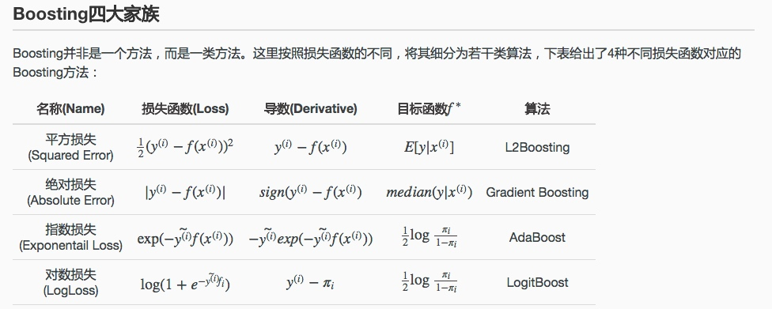

 集成学习是一种机器学习范式，是利用多个分类器来组合成一个分类器的方式。集成学习(ensemble learing)主要包含以下几大类：
- **boosting**
- bagging(boostrap aggregating)
- stacking
- blending

历史由来：Kearns和Valiant首先提出了”强可学习（strongly learnable）”和“弱可学习（weakly learnable）”的概念。他们指出：

> **在概率近似正确（probably approximately correct，PAC）学习框架中：**  
>   
> ① 一个概念（一个类，label），如果存在一个多项式的学习算法能够学习它，**并且正确率很高**，那么就称这个概念是强可学习的；  
> ② 一个概念（一个类，label），如果存在一个多项式的学习算法能够学习它，**学习的正确率仅比随机猜测略好**，那么就称这个概念是弱可学习的。
> 
> Schapire后来证明了: **强可学习和弱可学习是等价的。** 也就是说，**在PAC学习的框架下，一个概念是强可学习的 充分必要条件 是这个概念是弱可学习的。** 表示如下：
> 
> 强可学习⇔弱可学习

如此一来，问题便成为：在学习中，如果已经发现了”弱学习算法”，那么能否将它提升为”强学习算法”？

# bagging系列
也称为自举汇聚法(boostrap aggregating)：
从原始数据集中有放回的抽取n个训练样本，进行k轮抽取，训练k个模型。然后最终将这k个模型结果进行叠加。分类任务通常使用投票的方式，回归任务

比如随机森林

# stacking
将训练好的所有基模型对训练基进行预测，第j个基模型对第i个训练样本的预测值将作为新的训练集中第i个样本的第j个特征值，最后基于新的训练集进行训练。同理，预测的过程也要先经过所有基模型的预测形成新的测试集，最后再对测试集进行预测

# bending
将训练数据进行划分，划分之后的训练数据一部分训练基模型，一部分经模型预测后作为新的特征训练元模型。测试数据同样经过基模型预测，形成新的测试数据。最后，元模型对新的测试数据进行预测。
融合前面的方式

# boosting系列

boosting的思路： 从弱学习算法出发，反复学习，得到一系列弱分类器，然后组合弱分类器，得到一个强分类器。Boosting方法在学习过程中通过改变训练数据的权值分布，针对不同的数据分布调用弱学习算法得到一系列弱分类器。

具体地需要解决如下两个问题：
1. 在每一轮学习之前，如何改变训练数据的权值分布？
2. 如何将一组弱分类器组合成一个强分类器？

## Adboost(adaptive boosting)

对于一个二分类问题，adboost通过如下方式学习弱分类器，然后将弱分类器线性组合成一个强分类器。

> adboost算法将改变数据权值分布和弱分类器组合这两个问题合并在了一个算法里。简单来说，就是一个模型加权或者说是一个可加模型
> $$f(x) =\sum \alpha_mG_m(x)$$

step1: 初始化训练数据的权值分布,即假设初始化权重一样
$$D_1 = (w11,w12,...w_{1n}), w_{1i}=1/n$$
step2: adboost开始反复学习基本分类器，在每一轮m=1,2...M依次执行如下操作：
	a) 使用当前分布Dm加权的训练数据集，学习基本分类器$G_m(x)$: X -> {-1, 1}
	b) 计算基本分类器$G_m(x)$在加权训练数据集上的分类误差率
		$$e_m = P(G_m(x_i)≠y_i)=\sum_{G_m(x_i)≠y_i} w_{mi}$$
	c) 计算$G_m(x)$的系数，$\alpha_m=1/2log((1-e_m)/e_m)$, 表示Gm在最终分类器的重要性。从表达式来看，误差越小的其权重越高。也相当于是模型的可信度。
	d) 更新新的训练数据集的权重 $D_{m+1}=(w_{m+1, 1}... w_{m+1, n})$ 其中Zm是对w做的归一化。
	$$w_{m+1, i}= w_{m, i}/Z_m exp(-\alpha_m y_i G_m(x_i))$$即
	
	对于每次模型中样本权重的更新采取如上的方式，对于预测对的样本由原来的权重值乘以一个小于1的系数，对于预测错误的样本，则乘以一个大于1的系数。最终再做下归一化。
	另外也可以看到，其系数的大小是与$\alpha_m$ 有关的，基模型效果越好的$\alpha_m$ 越大，对应的系数调整的幅度也越大。而不好的模型，没有这么大置信度，相应大调整大幅度也较小些。
	
step3： 构建基本分类器的线性组合 $f(x)=\sum \alpha_m G_m(x)$

### 训练误差
adaboost的一个基本性质是：在学习过程中能不断减少训练误差。
【定理】AdaBoost算法最终分类器的误差界为

### AdaBoost与前向分步算法

对于加法模型$$f(x)=\sum_1^M \beta_m b(x; \gamma_m )$$
其中b为基函数，$\beta_m$ 为系数。给定训练数据以及损失函数L(y, f(x))的条件下，学习加法模型就是要最小化损失函数$$min \sum_1^n L(y_i, \sum_1^M \beta_m b(x_i;\gamma_m ))$$
通常这是一个复杂的优化问题。前向分步算法就是每次只学习一个基函数以及其系数，然后将所有结果做加权

Adaboost算法模型可以认为是：模型是加法模型、损失函数为**指数函数**、学习算法为前项分步算法的二分类学习方法。具体地：
- 因为adboost最终的模型形式是$f(x)=\sum \alpha_mG_m(x)$，所以显而易见是一个加法模型，而且前面介绍的学习策略也是前向分步算法。
- 证明损失函数是指数函数(略：这块详细看书吧）
最终求导下来，最优的$\alpha_m =1/2log(1-e_m)/e_m$ 就是前面设定的adboost中的模型系数。

QQ:
adboost为啥要用指数损失函数？
【【李航】北大教授，统计学习方法全集，学不会回来找我-哔哩哔哩】 https://b23.tv/Y2cR0O6

# 提升树

提升树是以分类树/回归树为基础分类器的提升方法，采用加法模型与前向分步算法。
$$f_M(x)= \sum T(x;\Theta_m)$$

### 提升树算法

所以提升树算法总的来说就是：
- 确定初始提升树f0(x) = 0
- 第m步的模型就是 $f_m(x) = f_{m-1}(x) + T(x;\Theta_m)$
- 通过经验风险最小化确定下一个决策树的参数$\Theta_m$

不同的提升树学习算法的差别主要是在损失函数的不同，具体地，会有如下常见的几种情况：

![[../../../附件/Excalidraw/集成学习 2022-05-12 18.20.53.excalidraw]]

1. 指数损失的分类问题—— 二叉分类提升树
只需将Adaboost算法中的基本分类器设置为二类分类树即可，相对于是adboost的一个特例。

2. 平方误差损失的回归问题 —— 二叉回归提升树
已知一个训练数据集 $\{(x_1,y_1), (x_2,y_2),...(x_n, y_n)\}$, 如果将输入空间x划分成J个互不相交的区域$R_1, R_2,...R_J$, 并且在每个区域上确定输出的常量c_j, 那么这颗树可以表示成:
$$T(X;\Theta)=\sum_{j=1}^Jc_jI(x\in R_j)$$
> zzz: 树T其实相当于是一个映射规则，$R_j$就是满足这些规则的x构成的一个区域集合，$c_j$就是满足这些规则的x最终的输出值。所以相当于一共有J个规则或者叶子节点。

根据提升树整体的算法，采用平方损失时候的步骤如下：
a) $f_0(x)=0$
b) $f_m(x)=f_{m-1}(x) + T(x;\Theta_m), m=1,2...M$
在给定$f_{m-1}(x)$的时候，需要求解:
$$\hat\Theta_m = argmin \sum_1^n L(y_i, f_{m-1}(x_i) + T(x_i;\Theta_m))=argmin \sum_1^n (y_i-f_{m-1}(x_i)-T(x_i;\Theta_m))^2$$
对于平方误差损失，有$L(y, f_{m-1}(x) + T(x;\Theta_m))= [r -T(x;\Theta_m) ]^2$，即对于回归问题的提升树来说，就是简单的拟合当前模型的残差。

3. 一般损失函数的一般决策问题—— 梯度提升树gbdt
对于一般的损失函数，可能求解最优问题不像前面两个这么简单。针对这个问题，Freidmao 提出了gradient boosting(梯度提升)， 即利用最速下降法的近似方法。
其关键是利用损失函数的负梯度在当前模型的值，作为回归问题提升树算法中的残差的近似值，拟合一个回归树。具体地：

其他更高级的提升树：gbdt，[xgboost](xgboost.md)， [lightgbm](lightgbm.md) ，[catBoost](catBoost.md)

|                    |     基函数/模型                                |     细节             |     优化方法                                                                                                               |
|:-------------------|:------------------------------------------|:-------------------|:-----------------------------------------------------------------------------------------------------------------------|
|      AdaBoost      | 可定义                                       |     指数损失           |                                                                                                                        |
|     gbdt           |  以cart回归树为基础分类器(分类/回归都是)    |     可自定义           |     只用一阶导数信息                                                                                                           |
|     xgboost        |     gbtree树分类
gblinear：线性模型
     |     可自定义           |     用到二阶导数信息；
加入正则项；

列抽样(借鉴了rf)；

缺失值处理；

分裂节点寻找的近似方法
                            |
|     lightgbm       |                                           |                    |   1 xgb是level-wise的，lgb是leaf-wise分裂的；
2 histogram算法，离散化；

3 支持类别特征
                                  |
|  catboost          |                                           |                    |                                                                                                                        |  

几种方法的对比：https://zhuanlan.zhihu.com/p/504646498

# 参考资料

http://www.cnblogs.com/gasongjian/p/7648633.html
http://www.52caml.com/head_first_ml/ml-chapter6-boosting-family/
https://zhuanlan.zhihu.com/p/84139957