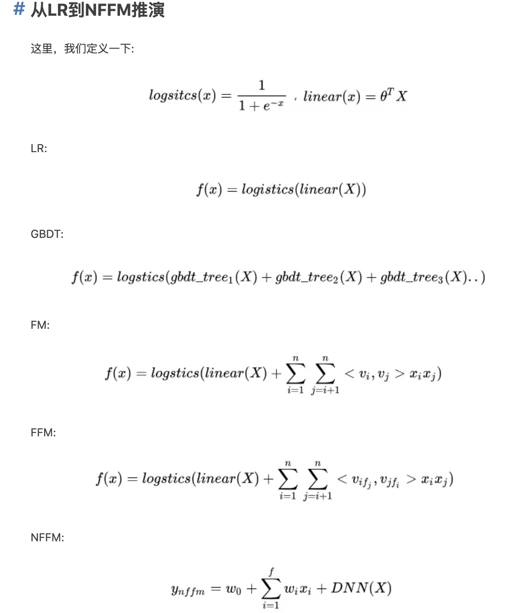

> 以《深度学习与推荐系统》、《推荐系统》等资料为主线，串联基础知识

# 前言背景

用户角度：推荐系统解决在“信息过载”的情况下，用户如何高效获得感兴趣信息的问题。
公司角度：推荐系统解决产品能够最大限度地吸引用户、留存用户、增加用户黏性、提高用户转化率的问题，从而达到公司商业目标连续增长的目的。

# 推荐算法

RS大致的演变路径经历了传统的推荐系统方式，以及基于深度学习的推荐方式。

## 1. 传统推荐技术

(1) 一开始是最经典的 协同过滤 & 矩阵分解 
[原理篇—1协同过滤](原理篇—1协同过滤.md)     [原理篇—2矩阵分解](原理篇—2矩阵分解.md)

(2) 逻辑回归模型族
在深度学习流行之前，逻辑回归曾经在相当长的一段时间里是推荐系统发主要选择之一：
- 数学上含义的支持：本身输出的表是概率CTR
- 可解释性比较好
- 工程化比较容易实现

局限性：表达能力不强，无法进行特征交叉

(3)[原理篇—FM系列](原理篇—FM系列.md)

(4) 组合模型。
上面的FM系列可以通过引入特征域的方式增加模型的交叉能力，但是最多也只能做到二阶特征的交叉，如果需要做更高维度特征交叉呢？
2014年，Facebook 提出了基于 GBDT+ LR的组合模型方案。

简而言之，Facebook 提出了一种利用GBDT 自动进行特征筛选和组合，进而生成新的离散特征向量，再把该特征向量当作LR模型输入，预估CTR的模型结

具体步骤如下：
一个训练样本在输入GBDT的某一子树后，会根据每个节点的规则最终落入某一叶子节点，把该叶子节点置为1，其他叶子节点置为0，所有叶子节点组成的向量即形成了该棵树的特征向量，把GBDT所有子树的特征向量连接起来，即形成了后续LR模型输入的离散型特征向量。

- 事实上，决策树的深度决定了特征交叉的阶数。如果决策树的深度为4，则通过3次节点分裂，最终的叶节点实际上是进行三阶特征组合后的结果。
- 但是同时GBDT的特征转换方式实际上丢失了大量特征的数值信息

**GBDT+LR组合模型的提出，意味着特征工程可以完全交由一个独立的模型来完成，模型的输入可以是原始的特征向量，不必在特征工程上投入过多的人工筛选和模型设计的精力，实现真正的端到端(End to End)训练。**
广义上讲，深度学习模型通过各类网络结构、Embedding层等方法完成特征工程的自动化，都是GBDT+LR开启的特征工程模型化这一趋势的延续。

(5) LS-PLM模型
是阿里巴巴曾经的主流推荐模型——“大规模分段线性模型”。 又被称为MLR混合逻辑回归模型。它在逻辑回归的基础上采用分而治之的思路，先对样本进行分片，再在样本分片中应用逻辑回归进行CTR预估。

在逻辑回归的基础上加入聚类的思想，其灵感来自对广告推荐领域样本特点的观察。举例来说，如果CTR模型要预估的是女性受众点击女装广告的CTR，那么显然，我们不希望把男性用户点击数码类产品的样本数据也考虑进来，因为这样的样本不仅与女性购买女装的广告场景毫无相关性，甚至会在模型训练过程中扰乱相关特征的权重。为了让CTR模型对不同用户群体、不同使用场景更有针对性，其采用的方法是先对全量样本进行聚类，再对每个分类施以逻辑回归模型进行CTR预估。LS-PLM的实现思路就是由该灵感产生的。

$$f(x)=\sum_{i=1}^m \pi_i(x)\eta_i(x)=\sum_{i=1}^m\frac{e^{u_ix}}{\sum_{j=1}^me^{u_jx}}\frac{1}{1+e^{-w_ix}}$$
- 首先用聚类函数π对样本进行分类（这里的π采用了softmax 函数对样本进行多分类），再用LR模型计算样本在分片中具体的CTR，然后将二者相乘后求和。
- 超参数“分片数”m可以较好地平衡模型的拟合与推广能力。
- 当m=1时，LS-PLM就退化为普通的逻辑回归

LS-PLM模型适用于工业级的推荐、广告等大规模稀疏数据的场景，主要是因为其具有以下两个优势。
(1)端到端的非线性学习能力：LS-PLM具有样本分片的能力，因此能够挖掘出数据中蕴藏的非线性模式，省去了大量的人工样本处理和特征工程的过程，使LS-PLM算法可以端到端地完成训练，便于用一个全局模型对不同应用领域、业务场景进行统一建模。
(2)模型的稀疏性强：LS-PLM在建模时引入了L1和L2，1范数，可以使最终训练出来的模型具有较高的稀疏度，使模型的部署更加轻量级。模型服务过程仅需使用权重非零特征，因此稀疏模型也使其在线推断的效率更高。

## 2. 深度学习方案
2016年开始，推荐系统和计算广告领域全面进入深度学习时代。
(1)与传统的机器学习模型相比，深度学习模型的表达能力更强，能够挖掘出更多数据中潜藏的模式。
(2)深度学习的模型结构非常灵活，能够根据业务场景和数据特点，灵活调整模型结构，使模型与应用场景完美契合。

前期探索：
[原理篇—AutoRec](原理篇—AutoRec.md)， [deep crossing模型](deep%20crossing模型.md)

初步框架 [NeuralCF](NeuralCF.md)， [PNN模型(Product-based Neural Network)](PNN模型(Product-based%20Neural%20Network).md)
wise&deep模型系列：[wide&deep模型系列](wide&deep模型系列.md)
[FM与wide&deep的结合](原理篇—FM系列.md#wide&deep)
沿着特征工程自动化的思路，深度学习模型从PNN 一路走来，经过了Wide＆Deep、Deep＆Cross、FNN、DeepFM、NFM等模型，进行了大量的、基于不同特征互操作思路的尝试。但特征工程的思路走到这里几乎已经穷尽了可能的尝试，模型进一步提升的空间非常小，这也是这类模型的局限性所在。

从这之后，越来越多的深度学习推荐模型开始探索更多“结构”上的尝试，诸如注意力机制、序列模型、强化学习等在其他领域大放异彩的模型结构也逐渐进入推荐系统领域，并且在推荐模型的效果提升上成果显著。
[原理篇-注意力机制](原理篇-注意力机制.md)

强化学习与推荐系统的结合

# 推荐系统特征工程

# 推荐系统冷启动

[原理篇—冷启动相关](原理篇—冷启动相关.md)

# 资源
学习资源：
- 当推荐系统遇上深度学习 https://www.jianshu.com/nb/21403842
-
https://blog.csdn.net/ciecus_csdn/article/details/103317180

# 综述

重要的推荐系统相关的国际会议:

- ACM的RecSys会议。 https://zhuanlan.zhihu.com/p/34004488

https://coladrill.github.io/2018/06/21/2018%E8%85%BE%E8%AE%AF%E5%B9%BF%E5%91%8A%E7%AE%97%E6%B3%95%E5%A4%A7%E8%B5%9B%E7%BB%8F%E5%8E%86/

学术界: 内容过滤->协同过滤->矩阵分解->深度神经网络模型
工业界: LR->GBDT等树类模型->FM/FFM等交叉模型->DNN模型

