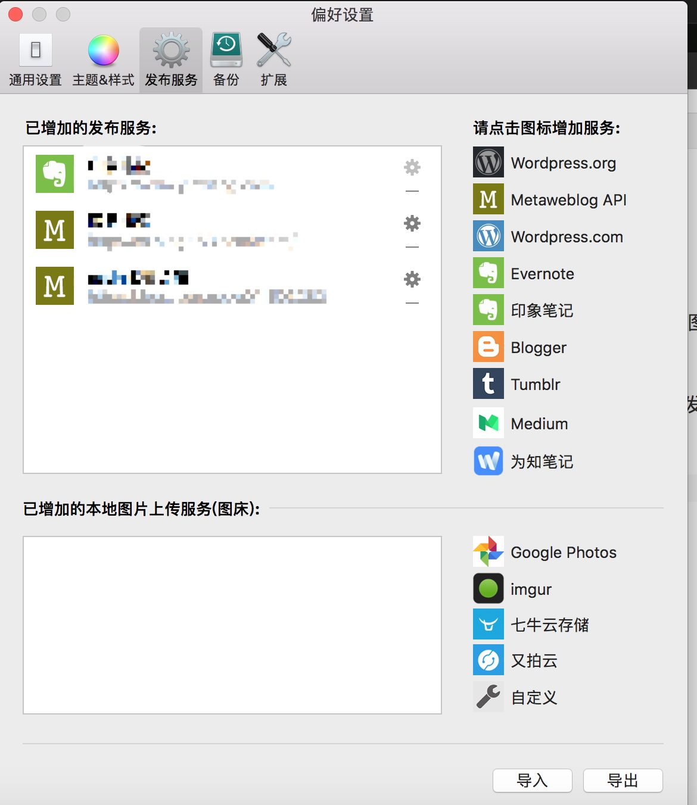

# Rmarkdown

## python支持

Rmarkdown对python兼容 https://github.com/rstudio/reticulate

使用例子: https://blog.csdn.net/qq_31342997/article/details/89433255

## 
绘图相关
https://plot.ly/r/shiny-gallery/
http://shiny.rstudio.com/gallery/

addins
http://rstudio.github.io/rstudioaddins/

## 图片

现在很多makdown编辑器是可以支持拖拽本地图片或者截屏就可以直接在markdown中生成图片的，非常方便，比如我现在在用的MWeb编辑器。

但是如果同一篇内容需要在不同的平台上进行发布，那图片处理起来就比较麻烦。因为需要重新上传到不同平台。
最方便的处理方式就是利用图床， 这里以七牛云存储为例。

step1： 首先在七牛官网上申请注册账号，并且添加**对象存储**

