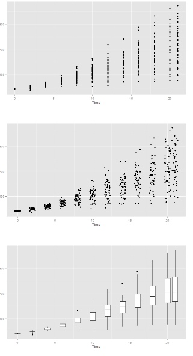

# R绘图散点覆盖问题

```
ggplot(diamonds, aes(x=carat, y=price))+ geom_point(alpha=.1)
ggplot(diamonds, aes(x=carat, y=price))+ geom_point(alpha=.01)
ggplot(diamonds, aes(x=carat, y=price))+ stat_bin2d()
```

当其中的一个或者两个变量为离散型数据时，也会导致覆盖的问题。我们可以使用jitter方法和box的方法。

```
ggplot(ChickWeight, aes(x=Time, y=weight))+geom_point()
ggplot(ChickWeight, aes(x=Time, y=weight))+geom_point(position="jitter")
#position="jitter"等价于geom_jitter，即下面的方法
ggplot(ChickWeight, aes(x=Time, y=weight))+geom_point(position=position_jitter(width=.5, height=0))
ggplot(ChickWeight, aes(x=Time, y=weight))+ geom_boxplot(aes(group=Time))
```




# 绘图中文问题

```

par(family='STKaiti')
symbols(x,y,circles = r,inches=0.3, bg="lightblue",fg="white", xlab='有点比',xlim=c(0.55, 0.8), ylim = c(0.3, 0.5),ylab='长点率')

text(x,y,group,cex=0.8,font=2)
```

