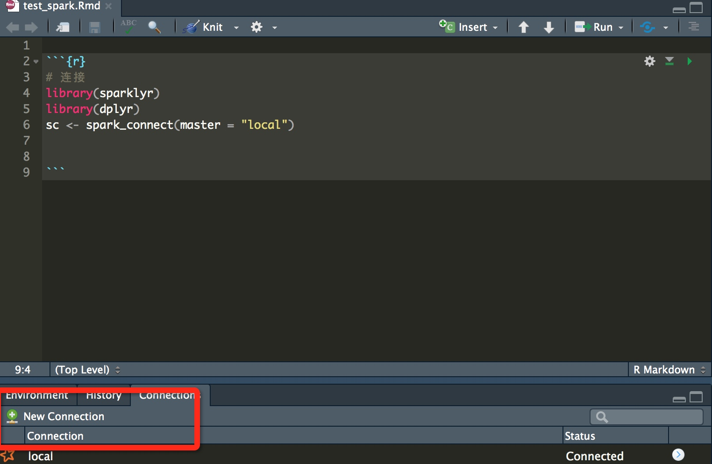

# Rspark

官网：
http://spark.rstudio.com/
内部 wiki（链接已移除）
http://gollum.baidu.com/sparkR-starter
 dplyr
https://cran.rstudio.com/web/packages/dplyr/vignettes/introduction.html


安装步骤：

```
install.packages("sparklyr")
library(sparklyr)
#spark_install(version = "1.6.2")
# install spark
spark_install(version = "2.1.0")
```

18机器上root用户登陆,安装成功

```
#安装
install.pacakges(sparklyr)
spark_install(version = "2.1.0")
```


## list

http://wiki.baidu.com/pages/viewpage.action?pageId=35960132


## 使用demo

```{r}
# 连接
library(sparklyr)
library(dplyr)
sc <- spark_connect(master = "local")
```
或者是直接通过Rstudio的交互界面连接：



在18机器的Rstudio上测试一些模型试验效果


