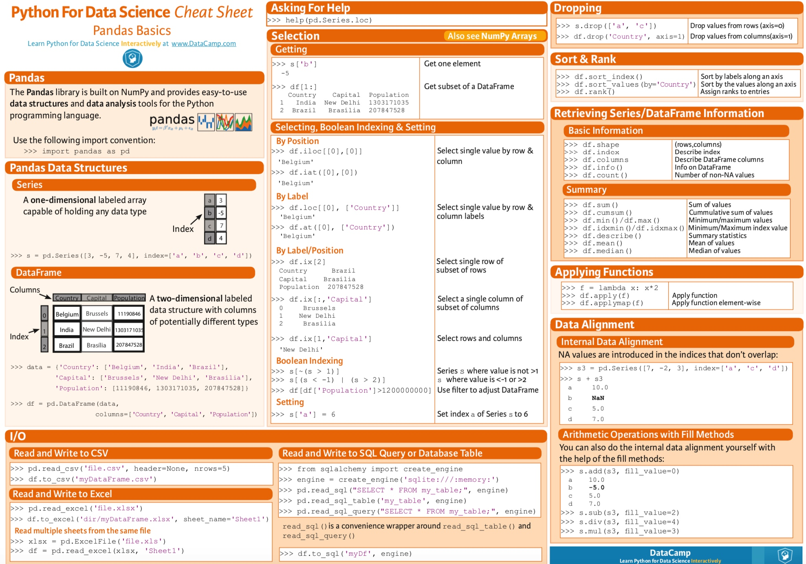

# 【基础】Pandas-DataFrame


# 1. 基础语法

## 数据读入和输出

```
df= pd.read_csv(file=xxx, sep=',')
df.to_csv(file_name)
df.to_csv(file_name2,encoding="utf_8_sig")   # 输出中文乱码时候可以指定encoding
```

## dataframe输出中文乱码
df.to_csv(file_name2,encoding="utf_8_sig")


## 随机抽样 
`df.sample(n=xx, replace=False)`

## 筛选行列

筛选指定的行列应该是dataframe经常用的语法了。
dataframe本质上行index 和列column的索引 + 数据

### 筛选列

行名或者列名有两种方式获取： 标签， 位置

**`df.loc[[index],[colunm]]` 通过标签选择数据**

```
df.loc[[0:3], ['a', 'b']]
```
只筛选列

```
df.a   或者 df['a']        # 单列
df[['a', 'b']]                 # 多列
```

**`df.iloc[[index],[colunm]]` 通过位置选择数据**

```
df.iloc[[0:3], [0,1]]
```

**`df.ix[[index],[column]]` 通过标签or位置选择数据**

**筛选在某个指定范围内的记录**
```
df[df['id'].isin(id_list)]
```

删除某列

```
df.drop([col1, col2], axis = 1)
```

## 查看数据的基本信息

```python
df.shape        # dataframe的(行数，列数)
df.columns    # 输出dataframe的列名
df.index         # 顺序输出每一行的行名
df.dtypes      # 每一列的变量类型
# 查看数据
df.head(n)
df.tail(n)
df.sample(n=xx, replace=False)
# 修改
df.columns = ['A','B']   #修改列名a，b为A、B
df.rename(columns={'a':'A'})  #只修改列名a为A
```
* dataframe的行数和列数


## list转dataframe

```
from pandas.core.frame import DataFrame
a=[[1,2,3,4],[5,6,7,8]]#包含两个不同的子列表[1,2,3,4]和[5,6,7,8]
data=DataFrame(a)#这时候是以行为标准写入的
```

## 修改列名

```
# 1、修改列名a，b为A、B。
df.columns = ['A','B']

# 2、只修改列名a为A
df.rename(columns={'a':'A'})
```


## 数据变换相关

```
## shift函数
df['昨天'] = df['今天'].shift(1)    # 读取上一行的数据
df['明天'] = df['今天'].shift(-1)    # 读取下一行的数据
## 删除某一列
del df[列名]
df.drop([列名], axis = 1, inplace = True)
## diff
df['涨跌'] = df['收盘价'].diff(-1)  # 求本行数据和上一行数据相减得到的值
## 累计值
df['成交量_cum'] = df['成交量'].cumsum()  # 该列的累加值
df[列名].rank() 输出排名
## rolling函数，移动平均
df['收盘价_3天均值'] = df['收盘价'].rolling(3).mean()
```

## 缺失值处理

```
df.dropna(how='any')    # 该行中有一个缺失就删除，how='all' 所有的都是缺失才删除
df.dropna(subset=['MACD_金叉死叉', '涨跌幅'], how='all')  # subset参数指定在特定的列中判断空值
# 缺失值补全
df.fillna(value=默认值)
df.fillna(method=xxx)
## 判断是否缺失
df.notnull()
df.isnull()
```

## df合并
```
## 左右合并
df_list = [data, d1, d2]
df = pd.concat(df_list)
## 上下合并
df1.append(df2)
```

merge操作
```
pd.merge(df1, df2, on = [key1, key2], how=xx)
```

pandas的多列拼接成一列函数.str.cat()
```
df[key1].str.cat(df[key2], sep='_')
```


## 时间相关函数

```
df['交易日期'] = pd.to_datetime(df['交易日期'])  # 将交易日期由字符串改为时间变量
df['交易日期'].dt.属性
属性包括 year, week, weekday, dayofweek ...
```

## apply 函数
很多时候需要对dataframe中的某列，或者某几列进行一些复杂的操作。这个时候就需要用apply这个强大的函数。其基本用法：
`DataFrame.apply(func, axis=0, broadcast=False, raw=False, reduce=None, args=(), **kwds)
`
* func是自定义的函数
* axis用来指定是行还是列


比如: 
```python
# example 1
def fun(data, a):
    x = data['x']
    return x**a

a = 2
data['x2'] = data.apply(fun, axis=1,  **{'a':a})
```

```python
# example 2 返回多列
def fun(data):
    x = data['x']
    return [x**2, x**3, x**4]
data[['x2', 'x3', 'x4']] = data.apply(fun, axis=1, result_type='expand')
```

如果传入的是多列：

```python
df['x_new'] = df.apply(lambda row: fun(row['x1'], row['x2']), axis=1)
```


## grouby


groupby后后出现无法筛选group的key的情况,可以通过`.reset_index()`进行

df.groupby([key1, key2]).agg(list).reset_index()


zz = final_act_data[ ['pid', 'floor', 'act_list_info'] ].groupby('pid').agg({ 'floor': lambda x: list(x),'act_list_info': lambda x: list(x)})


pandas cheat sheet



# 2. 效率类

## 循环遍历每行

```python
## method1: 这个效率快一些
for index, row in df.iterrows():
    print(row["c1"], row["c2"])
## method2
for i in range(len(df)):
    print(df.iloc[i]['c1'])
```

## pd.query 和pd.eval

### pandas 
pandas.eval(), pd.query()实现高性能运算， 他们底层都是调用的Numexpr库
```
result = pd.eval("(df.A + df.B) / (df.C -1)")
## 新增列
df.eval('D = (A+B) / c', inplace=True)

## 使用局部变量
column_mean = df.mean(1)
result = df.eval('A + @column_mean')
```
数据筛选 pd.query()
```python
result1 = df[(df.A < 0.5) & (df.B < 0.5)]
result2 = df.query('A < 0.5 and B < 0.5')
```


