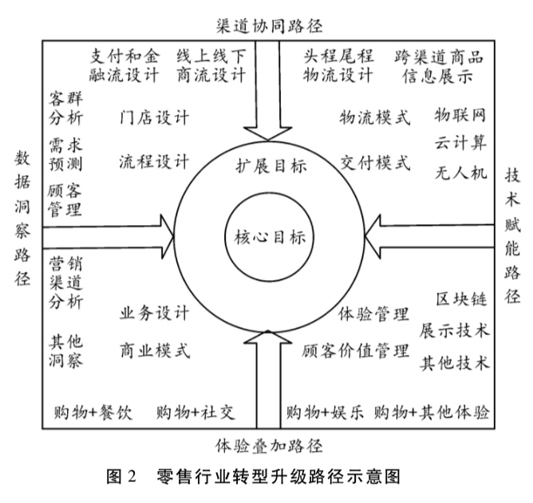
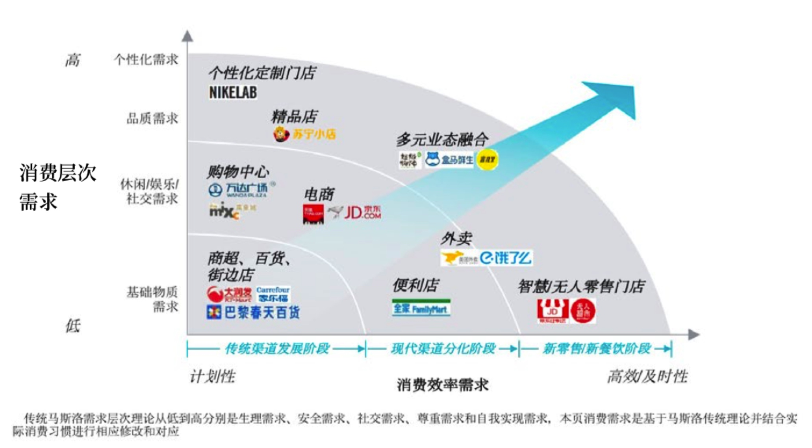

> 所属 Topic：[数字零售与商业空间](../../topics/%E6%95%B0%E5%AD%97%E9%9B%B6%E5%94%AE%E4%B8%8E%E5%95%86%E4%B8%9A%E7%A9%BA%E9%97%B4.md) · 类型：案例

# 4 新零售的模式&案例

中国贸促会研究院发布**《零售业的无界融合理论与实践》**报告，报告指出经济社会发展水平决定了零售业态的演变。人均GDP低于1000美元时，百货店占主导地位;1000-3000美元是超市成长期;3000-6000美元是便利店成长期; 6000-8000美元是网络零售成长期;此后则分别进入仓储店、购物中心和精品专卖店成长期，也是新的变革期。“2016年和2017年，我国人均GDP连续两年超过8000美元。

由经济发展阶段，以及前面所说的新零售之轮理论，新零售时代到来了。而其展现形式也是多种多样。

<!-- more -->
## 1. shopping mall 商业模式

## 2. 新零售的模式案例汇总

新零售显现的主要特征

* 渠道的数字化、社交化
* 产品品质化
* 消费体验化，个性化
* 支付的移动化

(1) 消费者全生态的智慧生活体验，即实体零售 + 智慧场景的方式
(2) 社交 + 体验式购物
(3)C2M模式，个性化定制与柔性生产
先收集消费者需求，然后再进行生产。
(4)混合业态

零售转型的一般路径：

* 渠道集成
* 体验叠加
* 数据洞察
* 技术赋能

服装
**优衣库**

线上：掌上旗舰店，微信小程序，官方app等。
用户可以在任何时间、地点完成购买
线下：当场试穿、修改裤长等服务。
服务的多样化，个性化。考虑不同人群的需求

**百丽鞋业**

效率问题，为 了找到合适的鞋子，店员不得不在仓库和 货架之间来回奔波，而最后的转化率也许 只有 5%。
有了数据之后需要及时传到前端能用起来

* 优化前端
* 运动社交，店员建立主题社群
*  针对频繁拿鞋问题，在拿A的时候加上B,C

**美妆供应链**

**蒙牛**

锁定年轻人，依靠综艺节目，电影IP等
FIFA世界杯赞助商，线上微信小程序活动，借助微信做精准营销

**孩子王**
提供0-14岁孩子的商品采购+育儿服务
智慧门店，扫码购， 育儿顾问老师
会员制度

**红星美凯龙IMP**
建立智慧营销流量场，将家装过程中涉及的商家全部纳入进来，方便了消费者体验，同时降低了品牌商的成本。
共享营销模式。
人找货 => 货找人

> zzz: 我们数据挖掘的价值不光要定位当前的一些情况，也需要把当前没有的，但是有用户潜在需求的方案给提供出来。

**作者小结**

==> zzz 汇总一些模式：

社交模式： 建立兴趣群
线上微信小程序营销活动
服务，顾问
全生命周期体验：

* 神测数据

https://www.sensorsdata.cn/blog/20180323/

* 腾讯智能零售
https://cloud.tencent.com/solution/smart_retail_solution
http://www.e-future.com.cn/news_details.php?nid=4064&lanmuid=3

* 永辉-云创 

商超
https://zhuanlan.zhihu.com/p/35703280

## 参考资料
1. 基于 “新零售之轮” 理论的 中国 “新零售” 产生与发展研究.pdf
2. 品类差异下的消费者购物价值与零售业转型升级路径——兼议“新零售”的实践形式.pdf
3. http://finance.huanqiu.com/chuangr/chuangtou/2018-09/13004416.html?agt=15422
4. 乔·韦曼(Joe Weinman) 美国零售业数字转型战略家、“云经济学” (Cloudonomics)概念提出者。著有《新动能 新法则》，他认为，传 统零售企业只有遵从“信息优势、方案领袖、亲密联盟、加速创新”这 些新法则，才能抓住新机遇。http://www.joeweinman.com/Bio.htm

