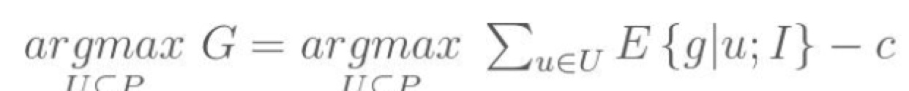
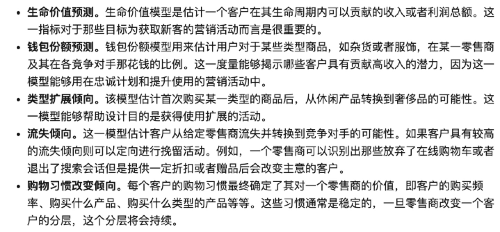

> 所属 Topic：[数字零售与商业空间](../../topics/%E6%95%B0%E5%AD%97%E9%9B%B6%E5%94%AE%E4%B8%8E%E5%95%86%E4%B8%9A%E7%A9%BA%E9%97%B4.md) · 类型：案例

# 5 线下挖掘案例-方法

常用的方法总结：

1. 响应建模

【场景】 给用户发优惠券，需要识别用户对这些激励的反应。考虑到收益与成本建立的一个优化问题。

zzz: 其中用户得到优惠券后被激励的概率p是未知的，可以利用过往的数据+同类型的人做后验的贝叶斯估计，可以不断更新这个人的属性向量。每个人会维护着一个概率向量。

<!-- more -->
> **倾向性建模(需要细化)**

zzz: 不同的模型都是解决一定场景下的问题，所以应该先梳理出具体的活动场景，然后再去找建模方案。

2. 推荐
【场景】个性化推荐，定向广告展示。交叉销售

用户的画像应该定位在**心理学画像**。

3. 需求预测

需求预测模型通常应用在市场营销活动设计中，因为这些模型能够解释需求回归量的影响

4. 价格差异
比如通过优惠券，店铺级价格区分、包装大小、销售渠道等方式使得对不同人价格不同。

优惠券 + 优惠券的使用成本（有些比较麻烦），能将客户进行区分

5. 促销活动优化

如何在考虑库存的条件下，设置最合理的促销价格。转化为一个优化问题

6. 类目管理

优化一个产品类目的整体收益，而不是单独一个产品收益（单一产品可能无存货或售罄，可以推荐类似产品）

