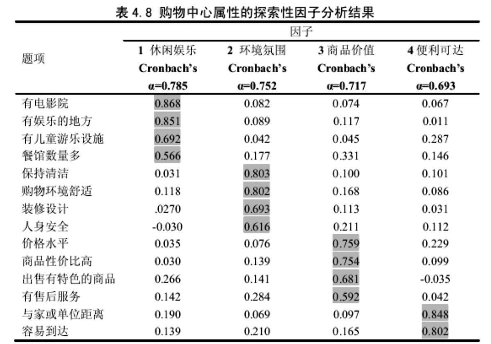
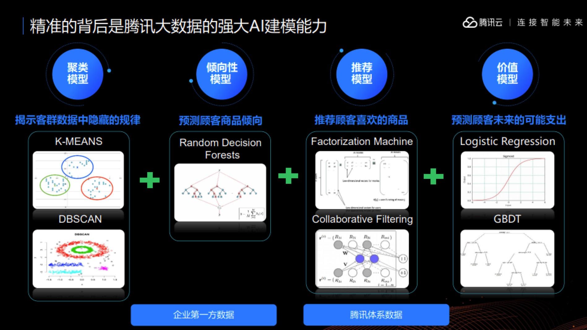
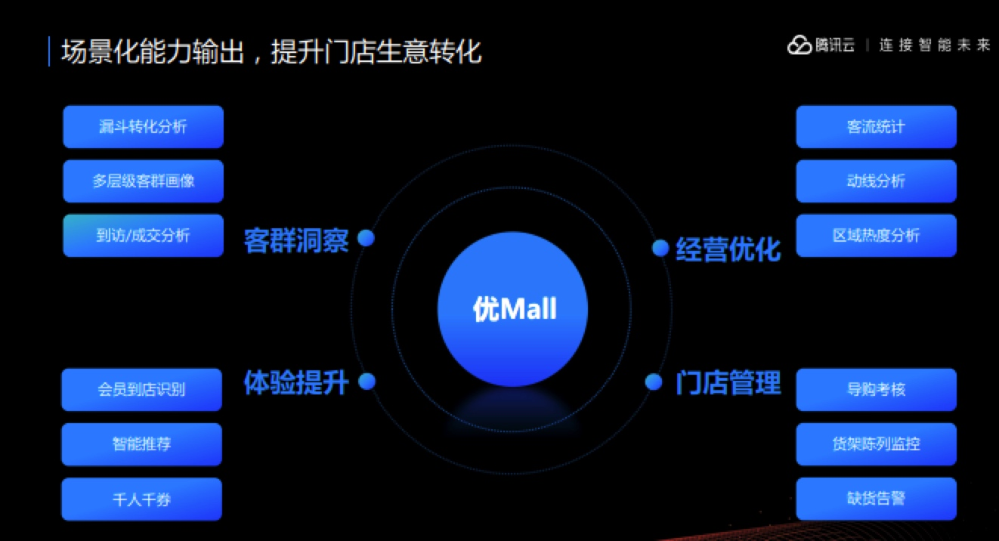
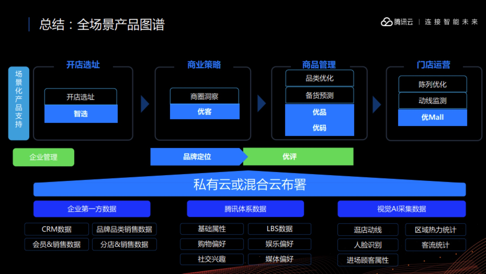

> 所属 Topic：[数字零售与商业空间](../../topics/%E6%95%B0%E5%AD%97%E9%9B%B6%E5%94%AE%E4%B8%8E%E5%95%86%E4%B8%9A%E7%A9%BA%E9%97%B4.md) · 类型：案例

# 5 线下挖掘的案例- 案例

案例： 包括两部分，一个是学术上的研究论文，一个是一些互联网企业的应用案例，比如现在做的比较好的腾讯和阿里。

**(1) 学术论文**
> 基于消费者类型的购物中心关联购买行为研究_张舒.caj
增加购买的宽度-关联购买， 这个只是分析了多样购买的一些维度分析，然后对于归结的4个因子建立结构方程模型。

<!-- more -->

消费者类型
作者综述了国内、国外的消费者类型研究，国外部分给了一个list，可以参考附录1。而研究的分类依赖的变量，可以归纳为购物导向与动机、购物行为、店铺/购物中心属性和心理属性四类。

作者给出了问卷设计包含的问题，1)商场环境   2)消费者行为  3)消费者满意度

作者最终划分出来的5类消费者：追求价值型消费者、休闲娱乐型消费者、感官体验型消费者、事不关已型消费者和高度在意型消费者

> 基于数据挖掘技术的零售业精确营销应用研究_陈竞.pdf

> @@ 大数据时代下零售行业客户分析模型研究.pdf

本文比较偏实践一些，介绍了一些实际应用的文献和方法。

零售业的客户分析主要是指客户需求分析。客户分析包括诸多内容:客户特征、客户意见、客户咨询、客户商业行为、 客户满意度、客户忠诚度、客户注意力、客户信誉度、客户购买力、客户流动 等等。

本文作者是通过CRM的角度进行的分析

> http://kreader.cnki.net/Kreader/CatalogViewPage.aspx?dbCode=cdmd&filename=1016233831.nh&tablename=CMFD201701&compose=&first=1&uid=WEEvREcwSlJHSldRa1FhdkJkVG1EWmxjVTFjSlR3aEh5dTNNNTJad3l5ND0=$9A4hF_YAuvQ5obgVAqNKPCYcEjKensW4IQMovwHtwkF4VYPoHbKxJw!!

(2) 案例——腾讯
https://ask.qcloudimg.com/raw/summit/pdf/%E6%99%BA%E6%85%A7%E9%9B%B6%E5%94%AE%E4%B8%93%E5%9C%BA%EF%BC%9A%E8%85%BE%E8%AE%AF%E4%BA%91%E6%99%BA%E6%85%A7%E9%9B%B6%E5%94%AE%E4%BA%A7%E5%93%81%E6%88%98%E7%95%A5%E5%8F%91%E5%B8%83.pdf

优客

优mall

> 阿里-零售云 lingshouyun.taobao.com
案例s： https://lingshouyun.taobao.com/case/ecommerce/quanmianshidai?spm=a2116n.12542494.0.0.35553541zAbsZN

## 参考资料

1. ☆☆☆万字长文，细数零售业中的那些数据挖掘问题（值得收藏） https://zhuanlan.zhihu.com/p/36927368
2. 下篇 https://zhuanlan.zhihu.com/p/37156880
3. 购物中心的空间布局：https://search.cn-ki.net/doc_detail?dbcode=CMFD&filename=1017024582.nh&df=FticQ5GOSN2M6JFNnZ3M3JDZ29yZR9CbtJXdMNDW4EGc5N1Sul0L3AHc69EcZJlS6tSODlFUvg3dohlQwlXSyRlWQRES==QS0ZUamJDOxIVW1lXUOlWYVljQkRjelpWb0hHOihWWJdWZOJUc3BzLi5EdINlZjZ3S3ZTT4tkavElRQVzQLdUWsRWT
4. 

