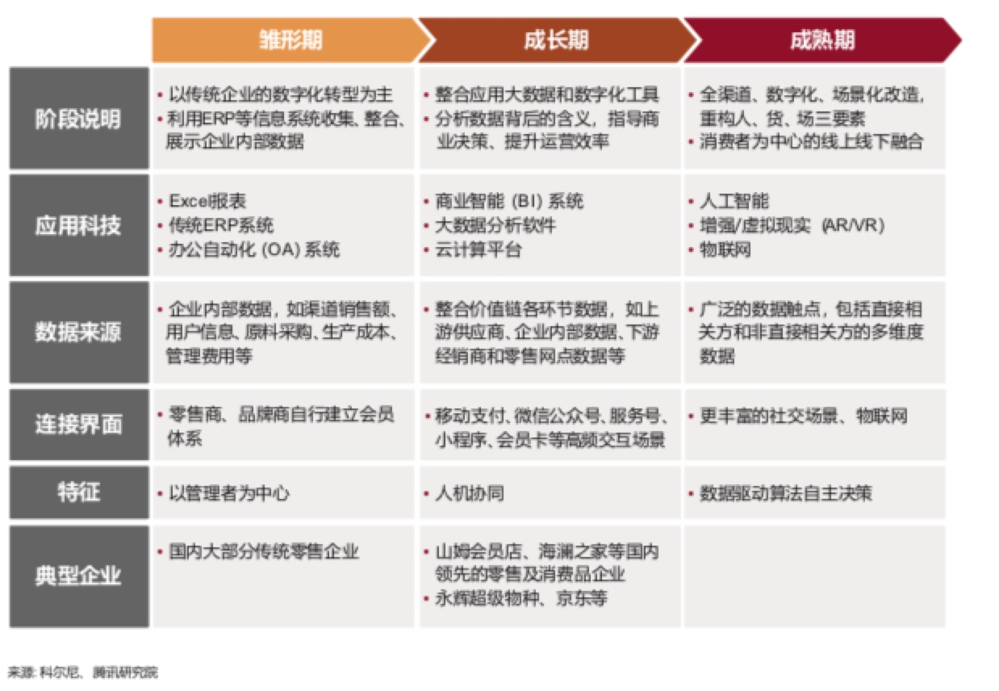
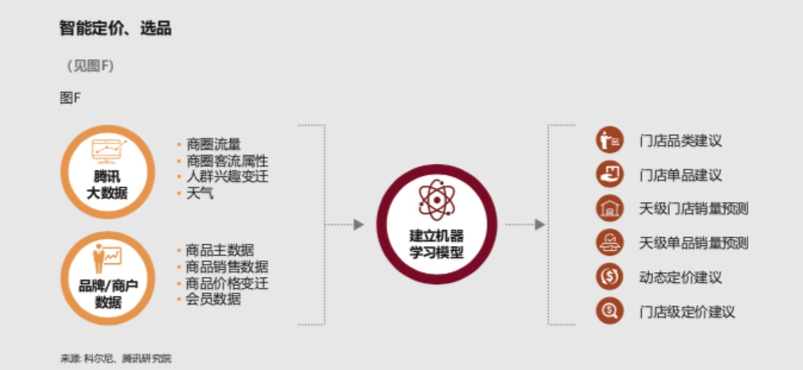
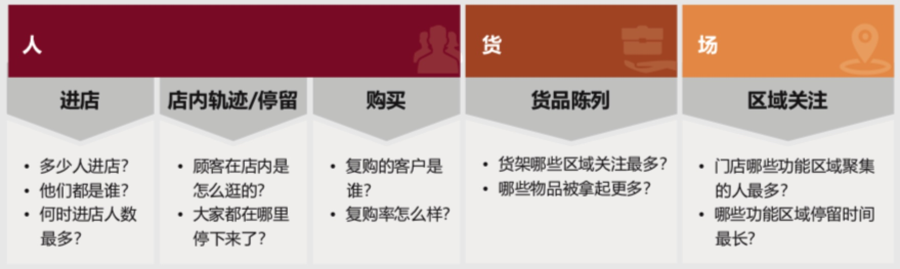

> 所属 Topic：[数字零售与商业空间](../../topics/%E6%95%B0%E5%AD%97%E9%9B%B6%E5%94%AE%E4%B8%8E%E5%95%86%E4%B8%9A%E7%A9%BA%E9%97%B4.md) · 类型：概念

# 0.一些研究报告

## 1.腾讯研究院——构建智慧零售完整图景

消费者从“人以群分”到“千人千面”
数字科技贯穿消费全旅程
线上线下界限模糊、加速融合
数据驱动运营升级

## 2.报告《腾讯数字生活报告2019》
https://xw.qq.com/partner/hwbrowser/20190522A0E6O1/20190522A0E6O100?ADTAG=hwb&pgv_ref=hwb&appid=hwbrowser&ctype=news

一、消费数字化
1 选择多样化，口碑与荐购时代
2 购买商品=> 购买服务
3 销售的智慧化，消费的个性化

二、娱乐成为基本生存

游戏、视频类app随城市层级下沉， 高沉浸感。
（沉浸感对应着心理学中的心流理论，表明人们在特定条件下的专注能带来极大的满足和愉悦感。这就解释了为什么对于那些疲惫奔波或倍感压力的现代人而言，玩游戏刷视频能在短时间内让人放松下来。这些精心设计的高沉浸感、碎片化娱乐方式，某种层面上说，也让娱乐放松的“效率”提升了）

 

