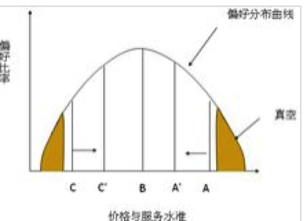
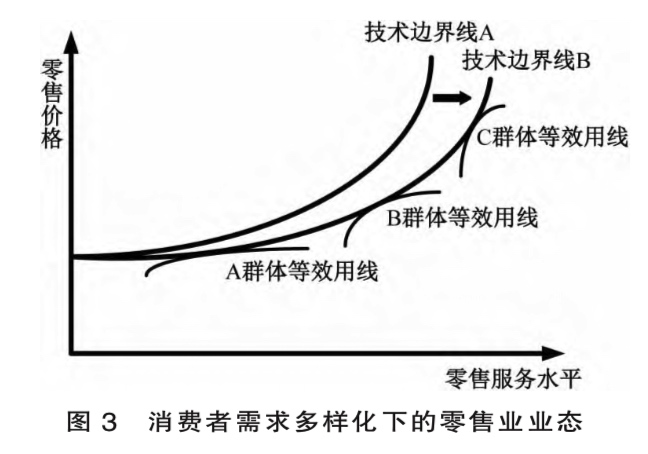
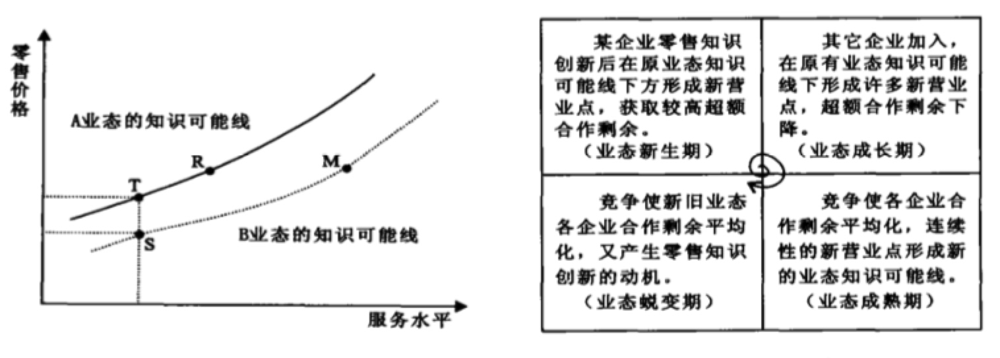
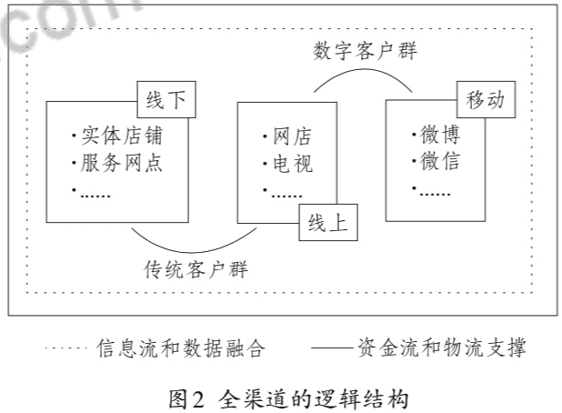
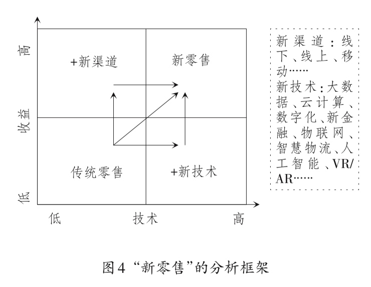
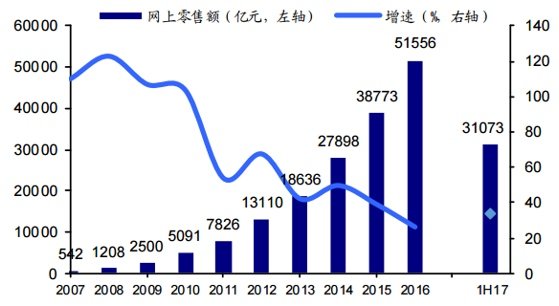

> 所属 Topic：[数字零售与商业空间](../../topics/%E6%95%B0%E5%AD%97%E9%9B%B6%E5%94%AE%E4%B8%8E%E5%95%86%E4%B8%9A%E7%A9%BA%E9%97%B4.md) · 类型：概念

# 3. 零售发展

在了解新零售之前，先对零售行业本身的发展进程做一个梳理。对于零售业的演进历程说法众多，这里例举出来认可比较多的一个说法。

* 百货商店
* 连锁商店
* 超级市场
* 智慧零售

<!-- more -->
从历史演进过程看，以往的零售变革的基本驱动力：**支付方式， 技术改进**，零售的未来发展会有如下几个维度的变化：

* 需求： 消费升级，带来顾客的需求变化
* 技术：
* 数据：
* 传播：多渠道传播
* 效率：
* 物流
* 资本

演变理论说法：

* 零售之轮
* 正空地带
* 新零售之轮： 技术边界线；

## @1 零售业态变迁理论及其新发展
### 1.基本假说
关于零售业的变迁过程有很多的理论假说
**（1）零售轮假说1958**
step1： 一般一个新的创新型零售商通过使用新技术或者减少零售服务来减低其运行成本，然后以较低的毛利率，较低的价格，大量的销售畅销、周转的商品来进入零售。
step2：获得消费者支持后，模仿者开始进入
step3：该经营商开始提供符合商品档次、改善经营设施和环境，以扩大毛利。
step4: 导致另一个新的创新型零售商进入，重复上面的步骤

其核心要点是创新型零售业态都是以低价格开始进入市场的。 问题：无法解释便利店这种

**（2）真空地带假说 1966**

真空地带假说首先假设经营同种商品的各种业态的特性是由店铺设施、选址、商品组合、销售方式、附加服务等综合性服务及与此相对应的价格水平来决定的，并认为服务水平越高，价格也就越高。

引入了价格-服务偏好曲线，零售业者提供的可能是低低，中中，高高中的某一种。

两头低低，高高的占比较少，容易被往种种挤压，从而两头出现真空，然后又有新的零售业者从这两头进入。

问题：真空假说引入了消费者偏好曲线，这个很难确定。

**（3）零售3轮假说1963**
 从价格和服务两个角度会有不同类型的业态类型，当有新的用户认可的类型进入后，原有的类型部门模仿新的类型，而新的类型也会进行一定的变动措施，最终结果是原有的和新进的相互共融，达到某种意义上的兼容。
 当有新的业态出现的时候，再重复上面的过程。

step1：第一阶段，出现低服务、低价格的A 和高服务、高价格的B
step2：现有的业态C和D无法阻止A,B进入，因此为了夺回客流，CD会部分模仿A和D的方式
同时A和B也会采用相应的调整措施
step3: 现有的业态和新进入的相互兼容。
step4：出现新的业态E,F开始重复以上步骤。

问题：没有考虑消费者的反应以及偏好。

**（4）新零售之轮假说 1996**

引入技术边界线的概念，技术边界线：零售业态在某一服务水平约束下的最低的零售价格水平线。
零售企业之间的竞争通常表现为价格或服务的警长，体现在沿技术边界线的移动。

step1: 领先的零售企业通过技术创新，自身的将技术边界线往右下移动（提高服务或者降低价格）
step2: 该企业获得超额利润后，其他企业开始效仿，推动自己的技术边界线移动。
step3：因为其他企业进入，原有的超额利润会逐渐消失。大家又处于同样技术边界线上
step4: 新一轮的技术革新企业再开始下一轮

另外不同群体之间的等效用线是不同的， 不同群体与技术边界线的切点分别体现了不同的价格组合模式。

注：论文零售业态的生成与演进：基于知识的分析（2002）中的零售业的螺旋态说法与新零售之轮基本一致。

**（4）环境理论**
认为零售业态的变化主要是由经济、人口、社会、文化、技术等环境条件决定的。
瓦蒂南比拉奇 提出
> 社会经济发展阶段划分为部落阶段 (tribe stage) 、小农阶段 (peasant stage) 、初期商业阶段 (early commercial stage) 、发达商业阶段 (highly commercial stage) 、初期产业阶段 (early industrial stage) 和发达产业阶段 (highly industrial stage) 等6个阶段, 与此相适应, 行商、市场 (集市) 、地方商人、杂货店、专业店、大型超市等6种零售业态分别是上述各个经济发展阶段的代表性业态。

**（5）冲突理论**

**其他理论**

 手风琴假说：零售业是按照综合-专业-综合，循环往复的路径进行的
 辩证法阵假说：
 零售生命周期假说：导入、成长、成熟、衰退。
 综合理论：如上的各种理论都有其适用性问题。 莱恩早在1960～1970年（这么早。。）尝试对各种理论进行综合研究

## @2 新零售的理论框架与研究范式
作者在新零售的研究范式中提到了关于新零售的一些概念。
**全渠道**
基础：线上渠道 + 线下渠道 + 移动渠道的跨界经营与融合)目的是为了满足客户的复合型体验，保证购物时间、地点、方式的便利性。
全渠道使得消费者与商家的touch point 接触点，不再受到时空和媒介因素的限制。

**新零售之轮**

新零售的分析框架

传统零售 + 新渠道 丰富消费场景
传统零售 + 新技术 促进业态更新

## 3. 用新零售之轮来解释新零售的发展过程

 小结：目前回溯的文献现实，新零售之轮的说法相对认可度比较高。这里再将其理论小结一下，并从消费者需求角度加上自己的一些理解。

* 新零售之轮中以某种（价格，服务）组合进入的方式，这种(价格，组合)的形式一定是迎合了部分消费者的需求，才有了他存在的可能性。
* 而在当前的新消费主义时代，这个服务所涵盖的范围会更广，比如(售后，生活体验，满足感等吧)， 品牌效应是否应该包含在这里？

> xxxx ， 这里可以再细化一下

自问自答：
Q1:为什么电商会进入？
一个是互联网的发展，使其技术上成为可能。另外是电商无线下租店的成本，人员管理等，使其开始时候成本较低，以（价格，服务）中的低价格，还有一些附加服务(包邮，7天无理由退款等)进入市场。
Q2: 为啥出现新零售，只靠线上电商不行吗，为什么发展线上+线下融合？
现在整体网上零售总额在增加，但是增速在放缓，电商的流量红利逐渐消失。

Q3:在淘宝，京东等众多电商林立的场景下，拼多多是如何杀出来的？

## 参考资料

1. 深度长文丨史上最全的零售发展史与发展观： https://www.iyiou.com/p/50393.html
2. 线下零售的运营模型： https://zhuanlan.zhihu.com/p/47179136
3. 零售业态变迁理论及其新发展： http://kns.cnki.net//KXReader/Detail?TIMESTAMP=637009684737330000&DBCODE=CJFQ&TABLEName=CJFD2002&FileName=DJKX200204011&RESULT=1&SIGN=Nsxgty8yEOujGHnbbfI%2bg0QDTdc%3d&UID=WEEvREcwSlJHSldRa1FhdkJkVG1EWnNibFM5T0FYRUZNcWRadDI4S0dDMD0%3d%249A4hF_YAuvQ5obgVAqNKPCYcEjKensW4IQMovwHtwkF4VYPoHbKxJw!!&autoLogin=1

4. 国外零售组织演进假说及其局限性分析。 http://www.szrmf.com/paper/14177.html
5. ☆☆☆新零售的理论框架与研究范式.pdf

