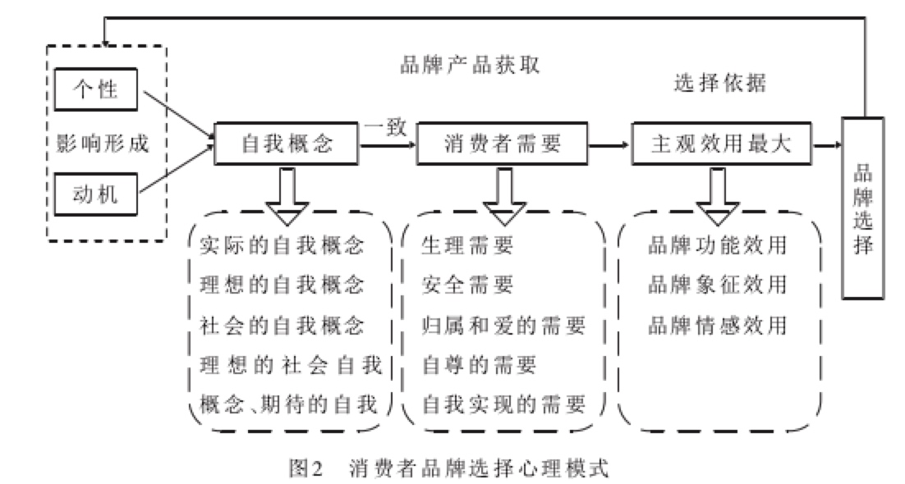
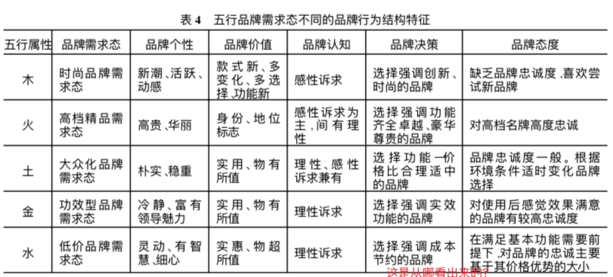
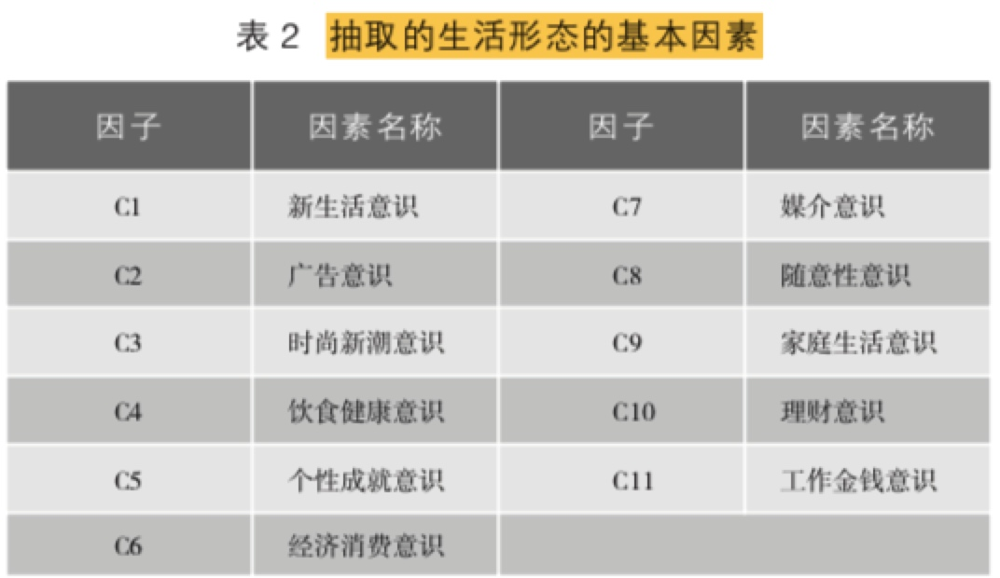
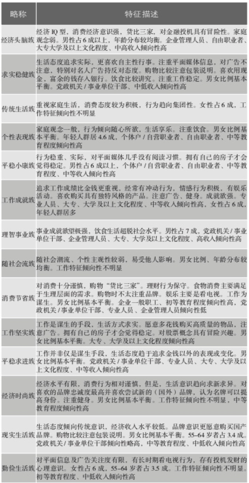
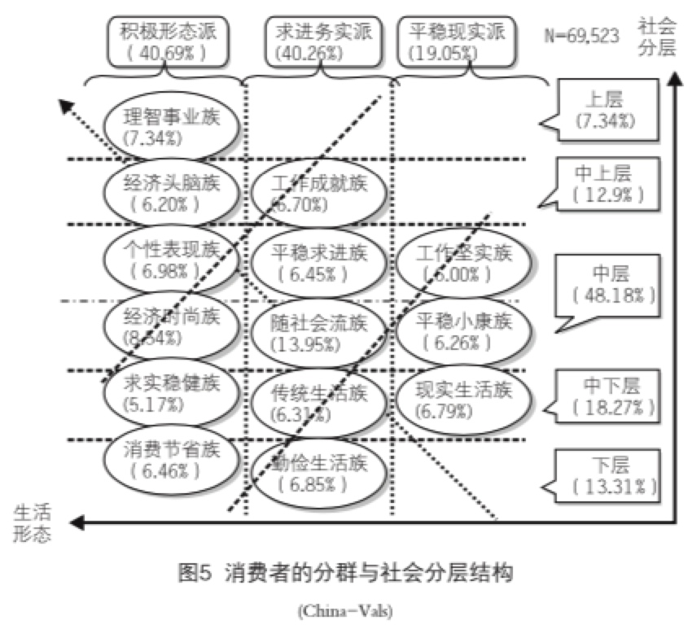
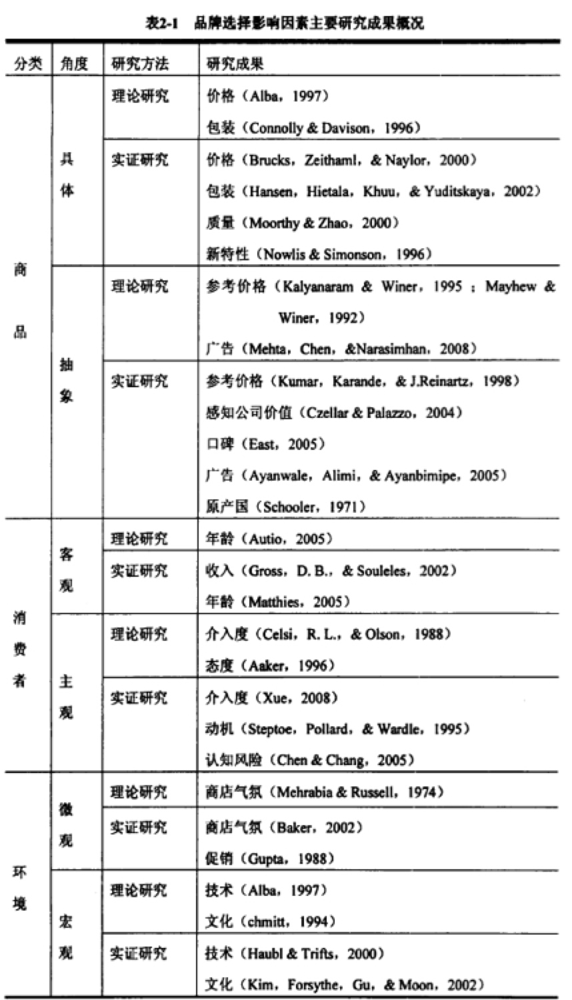
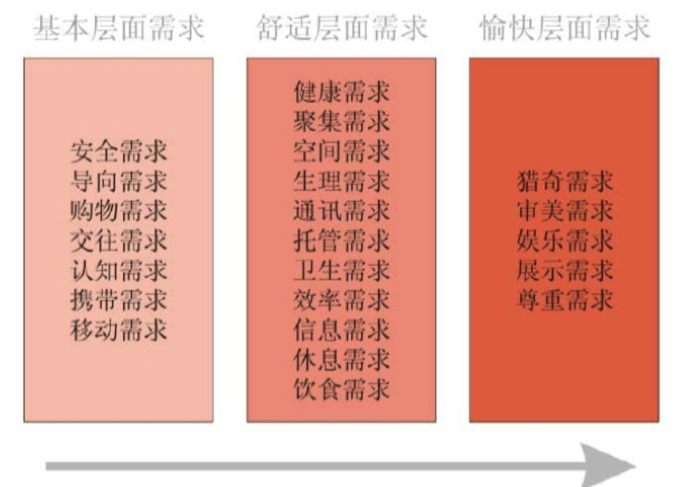

> 所属 Topic：[数字零售与商业空间](../../topics/%E6%95%B0%E5%AD%97%E9%9B%B6%E5%94%AE%E4%B8%8E%E5%95%86%E4%B8%9A%E7%A9%BA%E9%97%B4.md) · 类型：概念

# 6 消费者市场细分

目的：希望能从消费者行为动机的底层解释出消费者行为，最终构建出一个不同消费者对应的消费行为的一个全景图。

购物中心环境
Influence of mall attributes and demographics
on Indian consumers’ mall involvement behavior: An explorato- ry study. 中之处购物中心的环境的如下几个方面是影响消费者的三个重要方面。

* 配色方案
* 整体设计
* 空间布局

shelth认为消费者的选择是多个价值维度的函数。
感知价值：社会价值，情感价值，功能价值，体验价值，调价价值，认知价值

<!-- more -->

## @1 消费者品牌选择的心理过程与行为模式分析
http://www.lunwenstudy.com/shehuirl/77223.html

 

## @2 中国式品牌消费行为细分模型——罗纪宁(2005)
**市场细分研究**的当前概况：
（1） 消费者导向的细分: 主要用于理论分析，通过对消费者的需求和行为特征进行分类。包括个体心理、社会文化环境、行为决策等角度进行细分。
（2）产品导向的细分：主要为营销决策者使用，
（3）适应性细分:利用联合测量的方法，https://hbr.org/1975/07/new-way-to-measure-consumers-judgments
多因素实验，通过正交实验设计
 
作者认为：消费者导向的细分偏重理论研究虽然可以很好的理解消费者背后的心理原因，但是缺乏识别或洞察这种心理动机的方法，实践性不强。产品导向型的不能说明统计所得的各类消费态度与购买行为背后的动机，难以预测长期的变化。
 
西方研究：主要是生活形态细分，结合马斯洛需求模型+人工属性，利用因子分析+聚类分析的方法，vals2将消费者划分出了8个细分场景， 这种方案适用性，只能作为短期消费现象的描述。

 

该论文的创新：选择的分类标砖—气质身心，是一直稳定的变量。
 
 
 
## @3 china-vals

前面说过国外的VALS模型以及VALS2模型，因为不同国家的消费环境不同，所以其划分出来的类别不一定适合中国的情况。本文作者对30个城市的，7w名消费者做了调查，建立了china-vals模型。
中国消费者人群分类也有人在研究，
作者通过调查问卷，将数据进行因子分析-> 聚类分析得到模式类别。 该问卷是33个问题，对应着11个因子，最终聚类出了14个用户群。

作者分别探究了不同的用户画像数据在这14个用户群上的区分度。发现性别、年龄

> 知觉图 https://wiki.mbalib.com/wiki/%E7%9F%A5%E8%A7%89%E5%9B%BE

## @4 基于消费者认知视角的品牌选择行为研究

山大的博士论文。文献综述，影响因素主要分为3大类

* 环境因素
* 商品因素： 早起主要研究
* 消费者因素
    * 客观因素
    * 主观因素：主要来自和其他学科的交叉

消费者因素的研究经历了营销理论研究、数学方法研究、心理学方法研究。

本文作者总认知心理学的角度出发，研究消费者品牌选择的行为。即假定已经要买某类产品，消费者是如何从备选的品牌集合里选择自己所需的。

文献回溯的主要研究因素

消费者品牌选择行为研究综述

(1) 基于营销理论的方法
很多的流程图。。
(2) 基于数学的方法
(3) 基于心理学方法的研究

## 5.基于体验的商场顾客需求研究

《体验营销探析》一文中把用户体验的作用点分为五个模块感观模块、情感模块、思考模块、行动模块、关联模块。

作者通过问卷调查 + 主动观察进行收集数据，然后人工提取出了23个需求。

本文作者对影响顾客需求的因素研究主要研究了客观的因素：

* 环境因素：环境拥挤、色彩、光线、气味、音效、温度
* 地点
* 人：顾客自身因素包括： 
    * 进商场的意向：主动、被动； 
    * 进商场的目的：明确、模糊； 
    * 熟悉程度：熟悉、中间、不熟悉； 
    * 顾客的其它信息，例如是否时间充裕、消费的习惯等

针对这23个需求维度，作者提出了一些商场的设计原则来服务于这些需求

## zzz小结

如研究2中所指：对于消费者行为心理的分类大概分两大类，一种是从理论上，一种是通过设计调查问卷，通过因子分析-聚类分析得到用户分群。

多数研究分析了分群和人口属性之前的关系，发现性别，年龄，职业等因素是有显著差别的。

所以如果要定量的获得消费者背后的消费心理：

* 理论上的“模型”不可实践
* 通过问卷调查的方式，用户主动回答，或者是设计问题+归因分析+聚类自己总结标签
* 借鉴以前的别人研究，适用性问题？

应用，我们了解消费心理的目的：

* 从机制上理解，为啥不同用户会产生购买行为 
* 根据模型做泛化，给出一个预测模型，从而建立消费心理维度的用户画像，方便后续的分析。

方案：假设用户的真实消费心理或者动机 + 外界环境 => 消费者的行为
我们把未知的消费心理当做隐变量，通过因子分析得到的因子，认为是其潜在的决定模式。需要设计特征，能尽量包含这些潜在的模式。

## 参考

1. 购物中心消费者行为研究述评与展望.pdf。主要描述了j基于国外的shopping mall做的一些用研结果。购物中心环境、消费者的性别，年龄，职业等
2. http://www.199it.com/archives/251924.html
3. https://image.hanspub.org/Html/2-1170142_18934.htm
4. https://hbr.org/1975/07/new-way-to-measure-consumers-judgments

【】https://kns.cnki.net/KCMS/detail/detail.aspx?dbcode=CMFD&dbname=CMFD201801&filename=1017864566.nh&uid=WEEvREcwSlJHSldTTEYzU3EydDRNelhmM3dXTitZRlhBc3Z6NXN6OEt6Yz0=$9A4hF_YAuvQ5obgVAqNKPCYcEjKensW4ggI8Fm4gTkoUKaID8j8gFw!!&v=MDc2MDVMT2ZiK2RtRkNublZickxWRjI2R2J1K0d0VEtxWkViUElSOGVYMUx1eFlTN0RoMVQzcVRyV00xRnJDVVI=

【】http://kreader.cnki.net/Kreader/CatalogViewPage.aspx?dbCode=cdmd&filename=1014130412.nh&tablename=CDFD1214&compose=&first=1&uid=WEEvREcwSlJHSldRa1FhdkJkVG1EWnA2UGQvV3BZZHlFZm9RMXJacmlWWT0=$9A4hF_YAuvQ5obgVAqNKPCYcEjKensW4IQMovwHtwkF4VYPoHbKxJw!!

