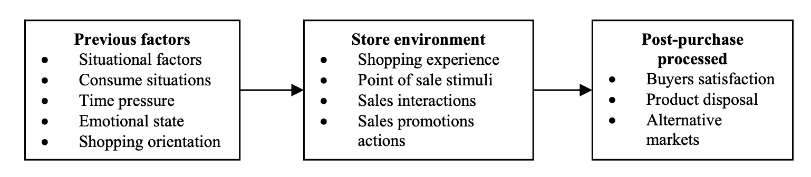

> 所属 Topic：[数字零售与商业空间](../../topics/%E6%95%B0%E5%AD%97%E9%9B%B6%E5%94%AE%E4%B8%8E%E5%95%86%E4%B8%9A%E7%A9%BA%E9%97%B4.md) · 类型：概念

# mall satisfaction

satisfaction: satisfaction is associated with the degree of fulfillment of consumer expectations. 它是一个累积的过程，受到中间不同环节的影响

