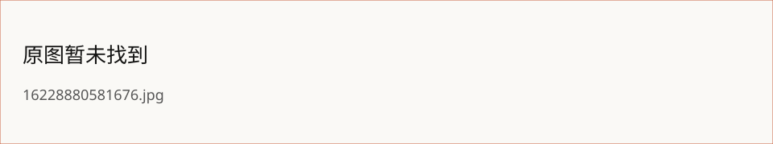

> 所属 Topic：[数字零售与商业空间](../../topics/%E6%95%B0%E5%AD%97%E9%9B%B6%E5%94%AE%E4%B8%8E%E5%95%86%E4%B8%9A%E7%A9%BA%E9%97%B4.md) · 类型：概念

# Saas
## 商业模式
- 传统买断
- saas收年费
- 消耗模式：按效果收费，多频次
- 分销售额
- 产业互联网
saas的本质其最核心、最本质的东西，就是“续费”

## 1 阶段1： 产品创意+商业模式选择
护城河：
- 替换成本
- 品牌价值
- 网络效应
- 细分行业

## 2 阶段2： 产品打磨+商业模式初验

> toC的产品可以“打痛点、爽点、痒点”，但是toB的产品只能打痛点

行业细分 => 需求调研 => MVP => 反馈迭代

toB产品定制化开发是不可避免的，需要把握住我们的定位，由项目 => 产品

## 3.阶段3：销售打法和验证销售团队毛利模型

1. 创造标准化的销售方案，在只有几个，十几个人的时候，就应该考虑如何进行标准化的复制问题了。

## 4. 扩张期组织发展

复制市场成功：复制成交—— 复制人才——复制团队
