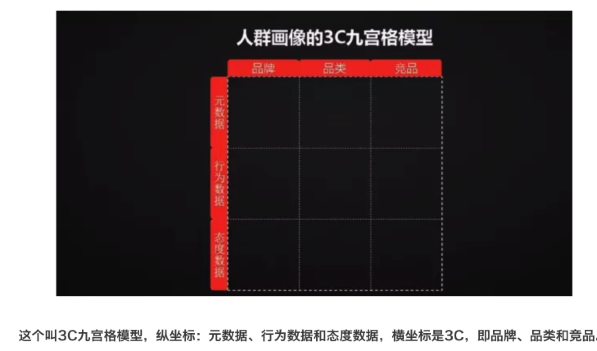

> 所属 Topic：[数字零售与商业空间](../../topics/%E6%95%B0%E5%AD%97%E9%9B%B6%E5%94%AE%E4%B8%8E%E5%95%86%E4%B8%9A%E7%A9%BA%E9%97%B4.md) · 类型：概念

# 关于用户画像

画像的目的是对人进行描述，从而针对不同人群的特征设计不同的营销方案。

## 参考

https://www.meihua.info/a/72019
http://m.linkshop.com/blog/show.aspx?id=321202&from=web
https://zhuanlan.zhihu.com/p/27392052
http://www.gzhshoulu.wang/article/5560272

