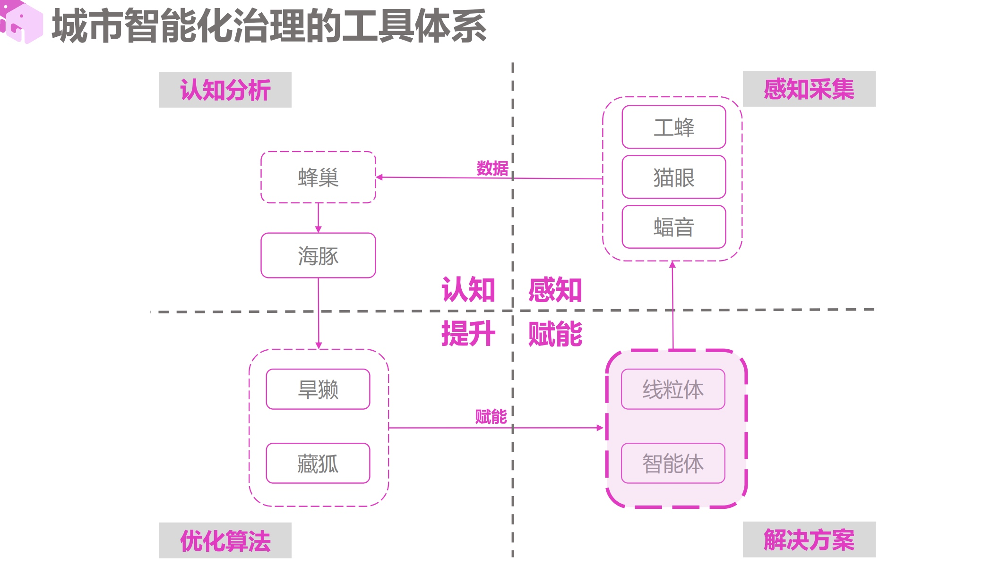
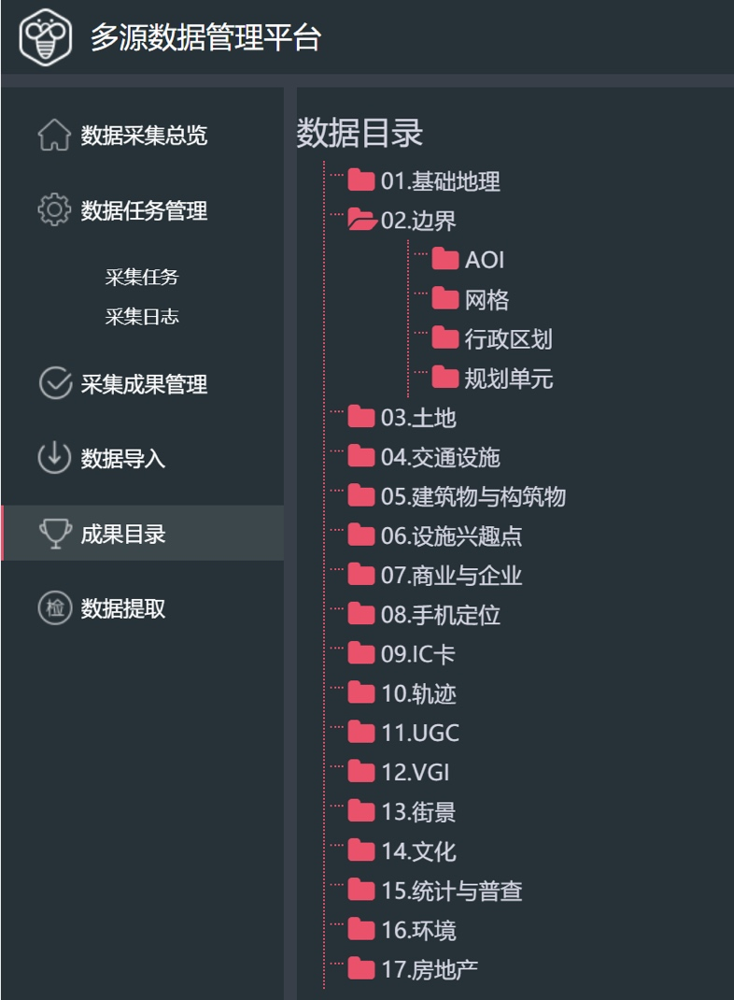
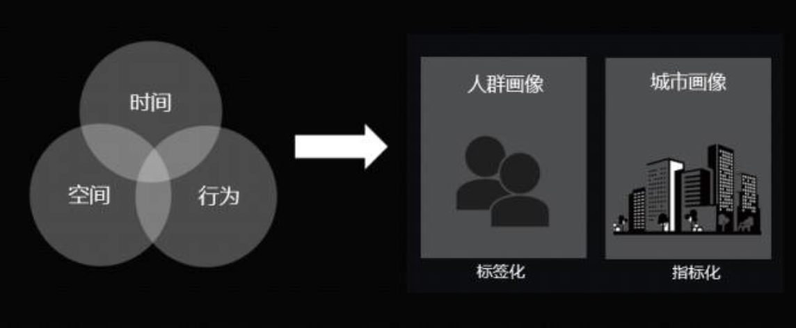

> 所属 Topic：[数字零售与商业空间](../../topics/%E6%95%B0%E5%AD%97%E9%9B%B6%E5%94%AE%E4%B8%8E%E5%95%86%E4%B8%9A%E7%A9%BA%E9%97%B4.md) · 类型：概念

# 茅明睿 - 城市万象 
产品相关的介绍 http://www.bigemap.com/information/cityplanning/detail20180723233.html
茅明睿 ppt&论文资料连接http://udu.org.cn/article.php?pid=13

> 认为以**感知城市、认知城市和提升城市**为原则，并最终从“人”的角度去设计产品，是比较清晰的一条产品思路。但茅明睿坦言，城市象限此次发布的五款新品，仍然需要经历市场的验证来确认其中的商业模式可行性

## 城市智能化规划方法论雏形

鸭子桥实验室

- 感知数据采集：多元数据管理平台。感知器、摄像头，众多其他数据接口

- 认知分析： BI系统，灵活展现，支持不同维度数据抓取
- 优化算法：评估当前可达度、开辟通路、新增选址
- 解决方案：对空间规划方案进行模拟验证的系统。比如开设新出口，修复道路，新增设施后，模拟效果

## 大栅栏案例

1. 如何对空间内人的活动进行观测和量化？
感知器-采集的数据
2. 基于量化的观测结果如何为大栅栏治理而服务？
评估指标
街道的情绪, 基于图像的情感分析，可以用来构造部分label样本

1. 如何将这种方法推广和应用到城市的各类街区

## 

https://mp.weixin.qq.com/s/yUhRylQTscZP0K75NZ1r-Q

指标化：
一个比较重要的指标：情感指标。方法1：图像识别 方法2:语义，获取文本评价数据提取情感