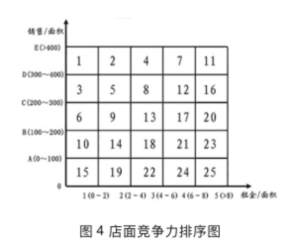

> 所属 Topic：[数字零售与商业空间](../../topics/%E6%95%B0%E5%AD%97%E9%9B%B6%E5%94%AE%E4%B8%8E%E5%95%86%E4%B8%9A%E7%A9%BA%E9%97%B4.md) · 类型：概念

# 常用度量指标

## 衡量零售店能力的度量指标

| 指标 | 计算 | 说明 |
| --- | --- | --- |
| 销售坪效 | 销售额/门店营业面积 | 每坪面积上的营业额(1坪=3.3平方米) |
| 租金坪效  | 租金/门店营业面积  |  |
| 销售比 | (租金成本+物管费)/销售额 |  |
|  |  |  |
|  |  |  |

ROI: 投资回报率 = 利润/投资额

店面竞争力排序(结合租金坪效+销售坪效)

