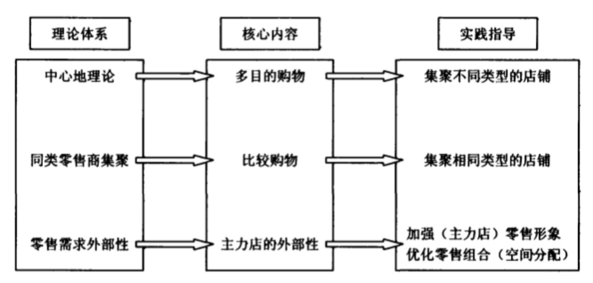
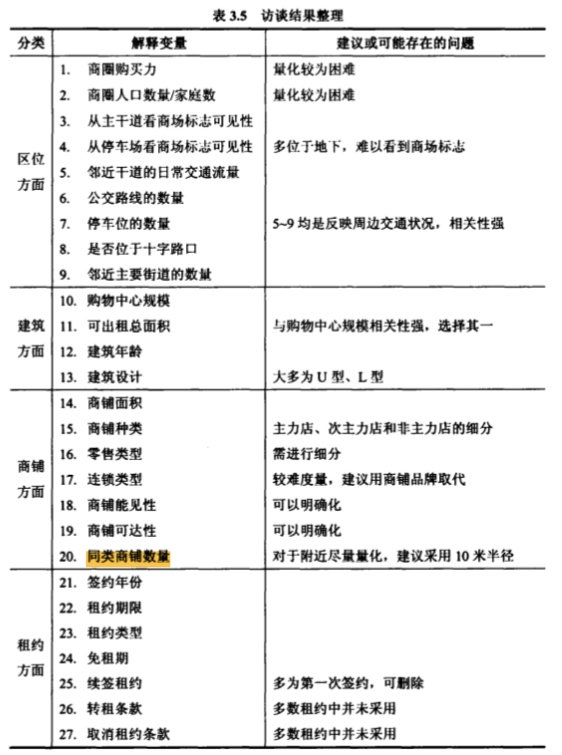
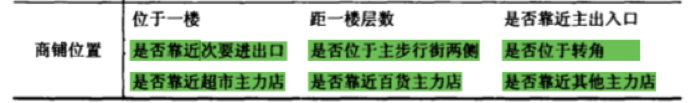
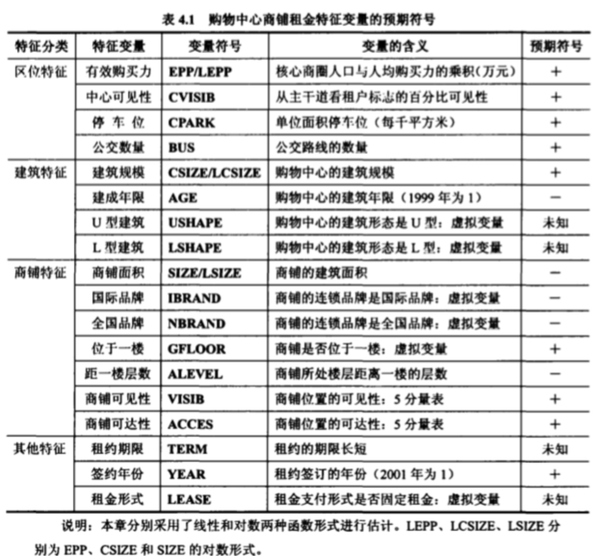

> 所属 Topic：[数字零售与商业空间](../../topics/%E6%95%B0%E5%AD%97%E9%9B%B6%E5%94%AE%E4%B8%8E%E5%95%86%E4%B8%9A%E7%A9%BA%E9%97%B4.md) · 类型：概念

# 购物中心-运营

万达运营中对租户的管理：

(1) 环境管理

(2) 经营管理：开店、闭店、巡场路线等

(3) 服务管理：

(4) 租赁管理

(5) 多种经营管理

(3) 租户形象管理

## 租金

商场收取的租金包含两部分 = 基本租金 + 分成
基本租金是一个固定的金额，而分成是根据店铺的销售额按照一定的比例收取。

### 1.零售租金的理论背景
(1) 中心地理论1933
在进行单目的的购物时，消费者会选择去最近的购物中心购买。
缺点：没有考虑多目的情况，实际上当用户有多目的时候，如果一个较远的购物中心可以满足其需求，其也会过去购买，节省购物总成本。

(2)同类零售商集聚理论
销售同类产品的店铺更可能聚集在一起

(3) 零售需求外部性理论
消费者被主力租户吸引到一个购物中心 , 然后在其他小型 非主力商铺也进行购物

租金的决定因素大概包括两个层面：
(1) 城市/国家层面
(2) 物业层面：区域状况、购物中心属性、商铺属性等

本文作者所采用的微观决定因素的变量包括：

1. 区位因素
    * 所处商圈
    * 区位的可见性，可达性
2. 建筑因素
    * 购物中心规模
    * 建筑年龄
    * 建筑设计
3. 商铺因素
    * 商铺种类：比如主力店，非主力店
    * 零售类型：
    * 商铺面积
    * 商铺位置
    * 连锁类型：全国连锁、本地连锁、独立店
4. 租约因素：比如租约中规定的租期长短、店主是否有取消租约权利、免租期长短等

作者说关于中国大陆的购物中心研究较少，究竟选择那些变量没有参照，所以作者做了调查访谈。初始因素中有些数据并不好获得，并且可能存在一定的多重共线性。

作者所采用的模型是“特征价格模型”， hedonic模型

最终是用的对数形式的回归

**租户组合分析**

根据实证分析得到的一些主要结论：

* 商铺位置对于主力店租金影响不显著
* 合理布局次主力店：距一楼层数和靠近主出入口对于次主力店有显著影响。距离一楼越近，距离出入口越近租金越高。 
* 次主力店通过集聚效应，能够对人流形成一个次级吸引力。对租金影响是正向的。

## 商铺

店铺按照其吸引力大小可以分为：主力店铺，次主力店(主要空间使用者)，非主力店铺

http://www.sohu.com/a/144110543_466446

