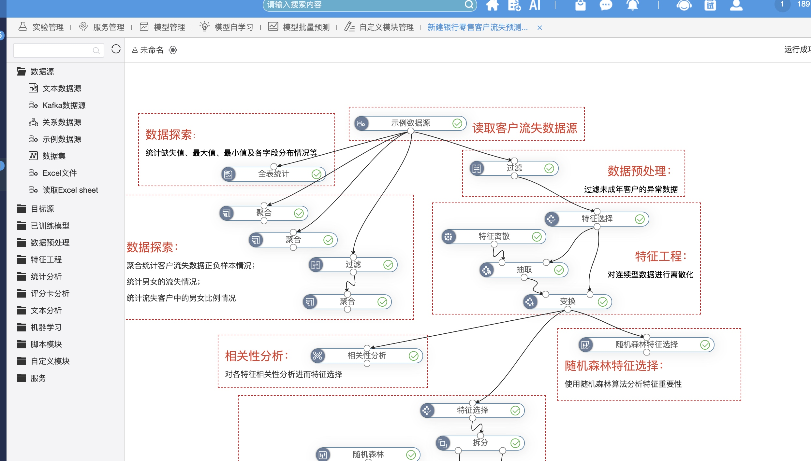
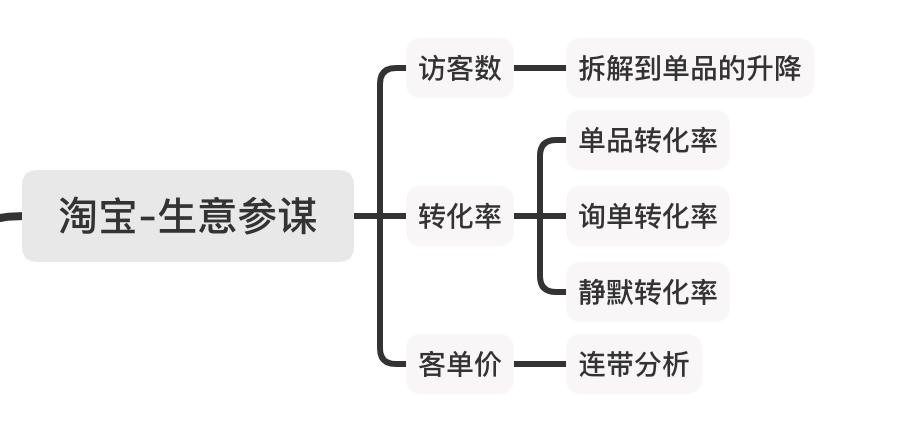

> 所属 Topic：[数据科学工作流](../../topics/%E6%95%B0%E6%8D%AE%E7%A7%91%E5%AD%A6%E5%B7%A5%E4%BD%9C%E6%B5%81.md) · 类型：概念

# BI工具

tableau，powerbi，finebi，smartBI

可视化： superset， Metabase

https://github.com/plotly/dash

## fineBI
http://demo.finebi.com

## smartBI

Augmented Analysis

# 淘宝-生意参谋-智能诊断

参考: https://market.m.taobao.com/app/qn/toutiao-new/index-pc.html?spm=a21ag.8365346.dynamic.1.2fbd410cuPUpVc#/detail/10624051?_k=v2sdml

围绕运营的黄金公式: 支付金额=访客数*转化率*客单价

然后从上到下，拆解因素，具体地:

# ebay的增强分析平台

