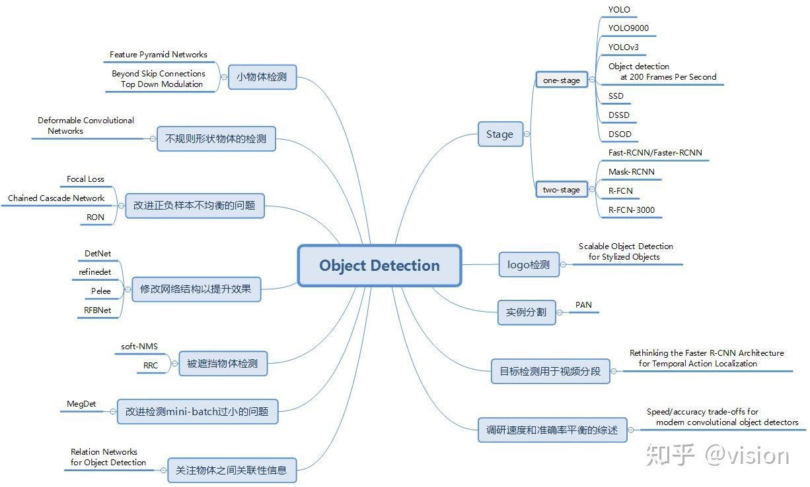
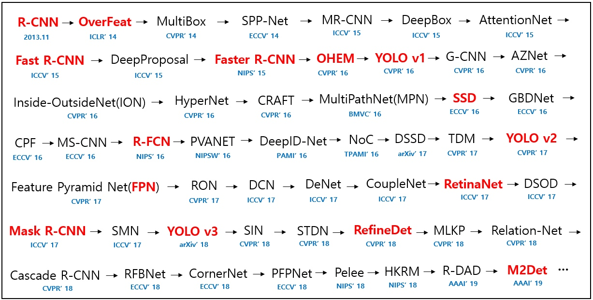

> 所属 Topic：[深度学习](../../topics/%E6%B7%B1%E5%BA%A6%E5%AD%A6%E4%B9%A0.md) · 类型：概念

# 【目标检测】

**two stage**

## 1.R-CNN
Region-CNN,基本思路如下:
- 候选提取框： `selective search` 启发式搜寻可能存在物体的区域
- 对每个提取框提取特征
- 图像分类， 用SVM
- 非极大值抑制

**one-stage**
- yolo
-  SSD

## 参考
https://zhuanlan.zhihu.com/p/40047760

yolo https://www.cnblogs.com/fydeblog/p/10447875.html

机器之心  https://www.jiqizhixin.com/articles/092301

github综述 https://github.com/hoya012/deep_learning_object_detection