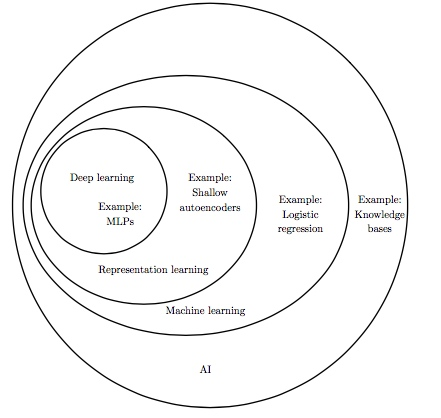
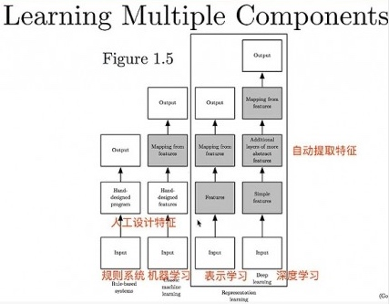

> 所属 Topic：[深度学习](../../topics/%E6%B7%B1%E5%BA%A6%E5%AD%A6%E4%B9%A0.md) · 类型：概念

# 第一章 引言

别人的读后总结，可参考「Deep Learning」读书系列分享（一） | 分享总结

https://www.leiphone.com/news/201708/LEBNjZzvm0Q3Ipp0.html

### 需要明确的几个概念范围

