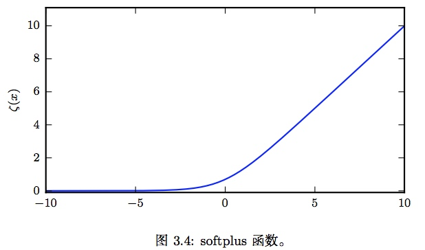
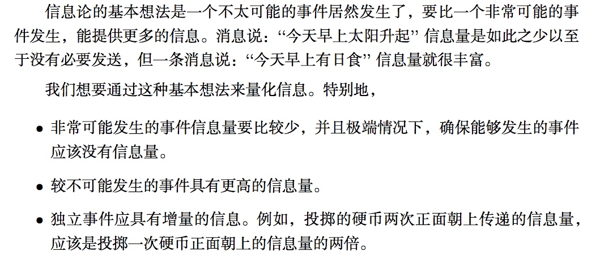

> 所属 Topic：[深度学习](../../topics/%E6%B7%B1%E5%BA%A6%E5%AD%A6%E4%B9%A0.md) · 类型：概念

# 第三章 概率与信息论

本章主要是介绍了一些概率论的基础以及常见的分布

## 1.常用函数的有用性质

* sigmoid 函数

$$\delta(x) = \frac{1}{1+exp(-x)}$$

* softplus函数
$$log(1+exp(x))$$

是$y=max(0,x)$的平滑版本

## 2.信息论
信息论是应用数学的一个分支，主要研究的是对一个信号包含信息的多少进行量化。

自信息：定义一个时间X=x的自信息
$$I(x) = -log P(x)$$

熵：
$$-\sum P(x_i) logP(x_i)$$ ^d128ed

### KL散度/相对熵
$$KL(P||Q) = -\sum P_i ln(\frac{P_i}{Q_i})=-\sum P_i(ln(P_i)- ln(Q_i))$$

注意：

* KL距离其实并不是严格的距离，不满足对称性以及三角不等式。

JS距离：
$$JS(P1||P2) = \frac{1}{2}KL(P1||(P1+P2)/2)+ \frac{1}{2}KL(P2||(P1+P2)/2)$$

### 交叉熵
相对熵的第一部分
$$KL(P||Q) = -\sum P_i ln(Q_i)$$

## 3.结构化概率模型——图模型(graphical model)

