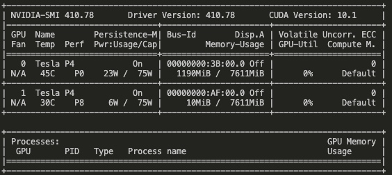

> 所属 Topic：[深度学习](../../topics/%E6%B7%B1%E5%BA%A6%E5%AD%A6%E4%B9%A0.md) · 类型：概念

# 训练常见问题


Q1: `/opt/conda/envs/open-mmlab/lib/python3.7/site-packages/torch/utils/data/dataloader.py`. It is possible that dataloader's workers are out of shared memory. Please try to raise your shared memory limit.
=>
在Dataloader中将num_worker设置为0。意味着每一轮迭代时，dataloader不再有自主加载数据到RAM这一步骤（因为没有worker了），而是在RAM中找batch，找不到时再加载相应的batch。
在起Docker容器时，设置 --ipc=host 或 --shm-size 或者
参考 https://zhuanlan.zhihu.com/p/143914966

Q2: CUDA out of memory

* 查看batch_size是否设置的较大
* 查看GPU 运行情况 `nvidia-smi`


一般默认是在GPU:0上运行的，但是看这个状态，应该是有任务在运行，所以尝试更改运行的GPU编号。
 直接终端中设定：
```
# 方式1
CUDA_VISIBLE_DEVICES=1 python my_script.py
# 方式2
import os
os.environ["CUDA_VISIBLE_DEVICES"] = "1"
```

监控运行状态 `watch -n 1 nvidia-smi`


