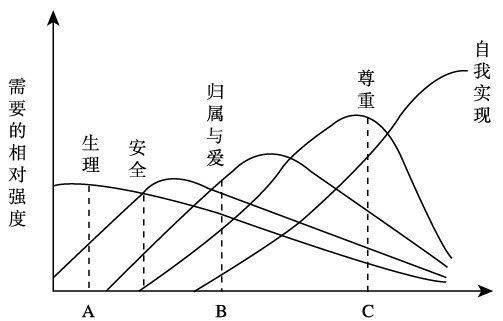
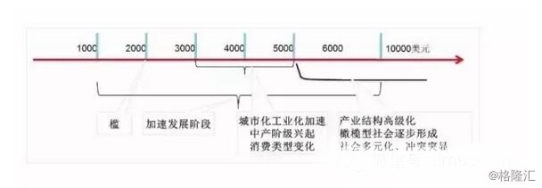
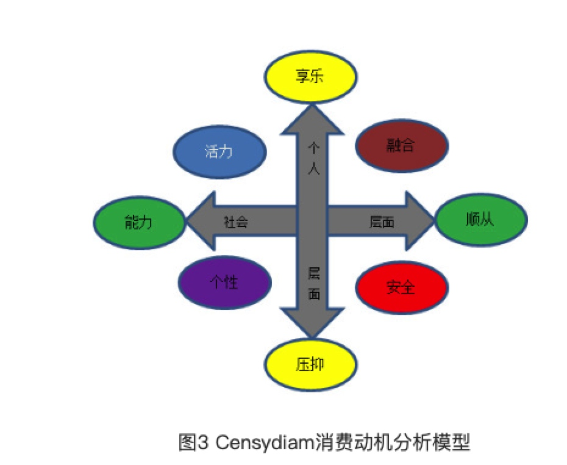
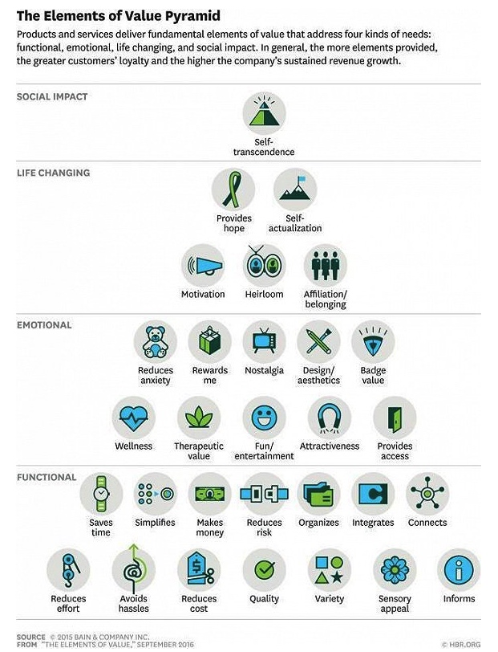

> 所属 Topic：[数字零售与商业空间](../../topics/%E6%95%B0%E5%AD%97%E9%9B%B6%E5%94%AE%E4%B8%8E%E5%95%86%E4%B8%9A%E7%A9%BA%E9%97%B4.md) · 类型：方法

# 1. 用户需求模型

常用的用户需求理论模型有如下几个

## 1. 马斯洛的层次需求理论（1943年）

* 生理需求（对食物、水、空气和住房等需求都是生理需求）；

* 安全需求（对人身安全、生活稳定以及免遭痛苦、威胁或疾病等的需求）；
比如健康，医疗，保险等产品类别

* 社交需求（对友谊、爱情以及隶属关系的需求）；
微信、陌陌、linkedin，熟人、陌生人、职场等。另外许多游戏中也会加入社交元素

* 尊重需求（对成就或自我价值的个人感觉，也包括他人对自己的认可与尊重）
一般都设计在产品的用户排名中

* 认知需求：是指对己对人对事物变化有所理解的需求，例如阅读书籍了解未知的事，各种内容付费产品等
* 审美需求：是指对美好事物欣赏并希望周遭事物有秩序、有结构、顺自然、循真理等心理需求，例如听音乐、视频等

* 自我实现需求：发挥自身潜能，实现一定的目标，比如写作。游戏中建立的成就感，打游戏获得冠军。

<!-- more -->
上述的是经典的马斯洛需求理论，其中5，6两项目是马斯洛后来加上去的。

结合现在的现状：
短视频，小视频： 尊重需求，社交需求

> 参考资料：
http://www.woshipm.com/pmd/646192.html

**马斯洛需求与经济社会发展关系**

而需求所处的主要阶段是有社会经济发展的阶段有所关联的。有专门研究马斯洛需求理论与经济发展之间关系的（比如https://www.gelonghui.com/p/83128)
主要是看人均GDP这个指标，将其主要内容概括下入：

作者举了个例子

如果卖橙子，你所从事的是商品业;如果将橙子送货上门，你所从事的是服务业;如果消费者在你的橙子生态园观光游玩、亲手采摘橙子甚至认领一颗橙子树，定期来浇水施肥管理，那你做的就是体验行业了。

**零售业的无界融合理论与实践**

< 1000, 百货店
1000-3000， 超市
3000-6000， 便利店
6000-8000， 网络零售期
仓储店、购物中心、精品专卖店

> 参考
1. 抖音 https://www.jianshu.com/p/119e60bb78ab
2. ☆☆☆从马斯洛需求寻找未来的投资机会  https://www.gelonghui.com/p/83128
3.零售业无界融合的理论与实践  http://finance.huanqiu.com/chuangr/chuangtou/2018-09/13004416.html?agt=15422
4.http://www.sohu.com/a/119304468_371463
5.https://wenku.baidu.com/view/516da2e1960590c69ec37699.html

**马斯洛需求理论对人的行为有哪些影响？**

## 2. KANO 模型（1979年）

kano模型感觉不完全是一个需求层面的模型，而是需求-满足之间关系的一个模型。可以用来研究需求-供给带给用户的满意度效应。体现了用户需求与用户满意度之间的非线性关系。

| 需求类型 | 需求说明 | 满意度 |
| --- | --- | --- |
| A魅力型 | 出乎意料的功能 | 有的话大幅提升满意度，无的话不影响 |
| O期望型 | 满意度与需求满足程度线性 | 有的话会满意，无的话会不满意 |
| M基本型 | 产品功能必须满足的用户需求 | 无的话会很不满意，有的话无影响 |
| I无差异型 | 无论满足与否，用户满意度不变 | 有无都无影响 |
| 反向型 | 无此功能反而满意，有的话不满意 | 比如一些付费功能 |
|  |  |  |

https://www.jianshu.com/p/1a39a3689dbd

* 满意度 = f(顾客需求/期望 ， 商场提供/实际)。 即现实与预期之间的差异。
* model最终划分了5档位
* 满意度具有连锁反应

## 3. Censydiam 用户动机分析模型

> Censydiam用户动机分析模型是由思纬市场研究公司的Censydiam研究机构提出来的，主要用于研究用户行为、态度或者目标背后的动机。该模型的基本逻辑是：用户的需求存在于社会和个体两个层面，面对不同层面的需求，用户会有不同的需求解决策略，通过研究用户采取的需求应对策略，我们可以透视用户内在的动机。其主要内容可以概括为“两维度”、“四策略”和“八动机”

> 参考 http://www.gupowang.com/article/view/5469

## 4.ERG需求理论

是在马斯洛需求层次理论基础上，提出的一种新的人本主义需要理论。具体内容包括：

* E 生存需要
* R 相关关系的需要
* G 成长发展的需要

## 5. 价值要素模型

> 参考 
https://36kr.com/p/5080235

价值要素模型可以说是马斯洛经典需求模型的一个延伸，针对消费者，分析他们行为背后的关键因素。由贝恩公司根据一些定性和定量的客户研究，提取出了30个关键词，或者说是关键因素。

情感营销：野兽派花店、钻石小鸟

## VALS 和VALS2系统
价值观和生活方式系统，由美国斯坦福国际研究院创立的一种系统，通过人的态度、需求、欲望、信仰和人口统计学特征来观察并综合描述人们。将人群进行了划分。主要是结合了马斯洛需求理论和美国社会学家戴维·瑞斯曼(David Reisman)提出的内在驱动者、外在驱动者理论。

VALS2模型基于四个人口统计变量和42个倾向性的项目。VALS2验明美国消费者的细分市场是基于对170个产品目录上产品的消费状况进行调查的结果。细分市场基于两个因素：

（1）消费者的资源：包括收入、教育、自信、健康、购买愿望、智力和能力水平。

（2）自我导向，或者说什么激励他们，包括他们的行为和价值观念。被验明的有三种自我导向：一是以原则为导向的消费者，他们被知识而不是感觉或其它人的观点所左右。二是以地位为导向的个体，他们的观点是基于其他人的行为和观点，他们为赢得其他人的认可而奋斗。三是面向行为的消费者，他们喜欢社会性的和物质刺激的行为、变化、活动和冒险。

根据自我导向变量，消费者被划分为8个细分市场：

* 现代者（Actualizers）：乐于赶时髦。善于接受新产品，新技术，新的分销方式。不相信广告。阅读大量的出版物。轻度电视观看者。
* 实现者(Fulfilleds)：对名望不太赶兴趣。喜欢教育和公共事务。阅读广泛。
* 成就者(Achievers)：被昂贵的产品所吸引。主要瞄准产品的种类。中度电视观看者，阅读商务、新闻和自助出版物。
* 享乐者(Experiencers)：追随时髦和风尚。在社交活动上花费较多的可支配收入。购买行为较为冲动。注意广告。听摇滚乐。
* 信任者(Believers)：购买美国造的产品。偏好变化较慢。寻求廉价商品。重度电视观看者。阅读有关退休、家庭/花园和感兴趣的杂志。
* 奋斗者(Strivers)：注重形象。有限的灵活收入，但能够保持信用卡平衡。花销主要在服装和个人保健产品上。与阅读相比，更喜欢观看电视。
* 休闲者(Makers)：逛商店是为了体现舒服、耐性和价值观。不被奢侈所动。仅购买基本的东西，听收音机。阅读汽车、家用机械、垂钓和户外杂志。
* 挣扎者(Strugglers)：忠实品牌。使用赠券，观察销售。相信广告。经常观看电视。阅读小型报和女性杂志。

## ☆☆小结

综述来看，还是以马斯洛的需求理论为基础，然后结合其他的维度进行细致的划分。马斯洛理论提供了一个分析的大框，在不同的场景下，用户需求对应的具体关键词是什么还需要自己研究。

以马斯洛理论为基础，摸底下当前零售消费场景下，用户的需求点都有哪些？？

## 参考资料
十大消费者研究模型 https://zhuanlan.zhihu.com/p/32773484
人均GDP 与发展阶段的研究： http://www.synochip.com/upload/file/2018/10/ceshi.pdf
https://zhuanlan.zhihu.com/p/26322256
用户画像|数据分析结合心理动力学剖析用户深层次情感需求，内附案例 http://www.gupowang.com/article/view/5469

