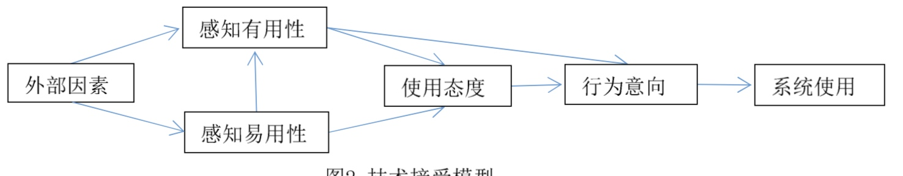
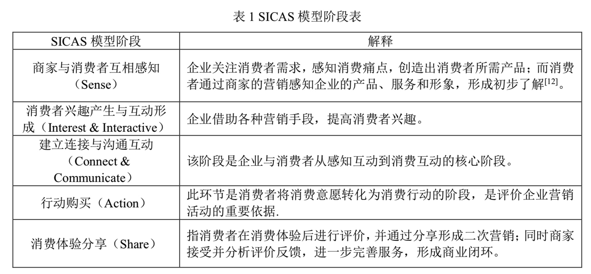
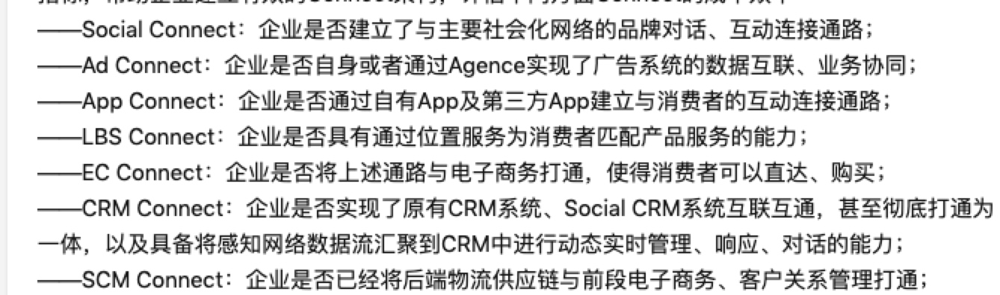

> 所属 Topic：[数字零售与商业空间](../../topics/%E6%95%B0%E5%AD%97%E9%9B%B6%E5%94%AE%E4%B8%8E%E5%95%86%E4%B8%9A%E7%A9%BA%E9%97%B4.md) · 类型：方法

新零售的本质是要回归人的价值，通过数字化的方式和手段，更好的服务于消费者。那么首先，我们需要来了解下用户的需求有哪些，其行为模式又有哪些呢？
    
关于用户的需求，比较经典的是马斯洛需求模型、KANO模型、Censydiam 用户动机分析模型、Vals价值模型等等。这个后续会做详细的叙述，这里主要叙述用消费者户行为分析模型。
    
恩格尔（Engel）、布莱克韦尔（Blackwell）和科拉特（Kollot）在其三人合写的《消费者行为学》中，第一次提出了比较完整的消费者行为概念。结合一些学术研究结果，梳理出来关于消费者行为模式的演进理论大概有如下几个过程：

* 传统市场环境下,美国广告学家刘易斯的AIDMA理论： attention - interest - desire - memory - action
* 移动互联网AISAS： attention - interest -search - action - share 
相比于传统市场下的，广告触达方式，因为网络的发展，用户可以直接自己search，购买之后有分享行为, 本质上还是以媒体为核心，以吸引消费者为主要目的。
* ISMES： 兴趣与互动= search = mo-payment = 线下体验 = show/share
* SICAS: sense- interest - connection - action - share

<!-- more -->
-- 参考 http://www.lunwenstudy.com/shehuirl/82338.html
https://www.zhihu.com/question/26558706
https://zhuanlan.zhihu.com/p/32773484

## @1 TAM模型(技术接受模型)，1989

> 参考：新零售对消费者行为影响研究.pdf
> https://blog.csdn.net/baimafujinji/article/details/49995735

TAM技术接受模型是在例行行为理论和计划行为理论基础上提出的，该模型是用来研究个体对一个新技术出现的接受程度和接受行为的

在零售场景下：

* 感知有用性：消费者在线上或线下的零售环境中，是否觉着能提高自己的购物效率
* 感知易用性：消费者能都快速掌握新零售环境下的购买、支付等新技术。

> zzz: 这里的有用性和易用性不单纯只技术本身的，而是针对用户说的。所以需要结合用户去考虑，可以结合马斯洛的需求理论，以及用户本身的能力水平进行感知的判断？

## @2 SICAS 模型
> 参考：基于 SICAS 模型的新零售消费体验升级研究——以盒马鲜生为例
> https://www.zhihu.com/question/26558706

SICAS 是一种消费者行为分析模型

* sense: 感知消费痛点、提供精准服务

精准选择受众，需要依赖于用户需求画像；进行精准营销、个性化服务

* interest：兴趣与互动阶段，主要是提高用户的兴趣体验。比如体验叠加（盒马现场烹饪）

* 连接和交流：深入交流，提高回头率。关系营销。粉丝群、线下活动。找到消费者与品牌的共同利益点。

* action: 提高消费质量，让客户享受到消费的便捷性。比如自助支付，送货上门。

* share： 培养粉丝口碑，形成再消费。

及时收集用户反馈，培养粉丝效应。

DDCI的研究（https://www.zhihu.com/question/26558706 )中对各个阶段中，需要关注的企业能力给出了详细说明

* 感知（是相互感知）搜索-feed

作者说，在感知阶段有6个衡量企业感知能力的指标：
- 感知率：识别的人/总的目标群体
- 感知量：属性的维度，信息量的多少
- 到达率：
- 理解力：感知到的信息是否能够理解、分析
- 感知效率
- 被感知率：
- 回馈率

* 兴趣-互动
- 兴趣互动成本效率指标：互动行动力，单位互动成本、点击率。。
- 兴趣互动内容特性指标：
- 兴趣互动品牌服务指标

connect & communication

此外还有 消费者链路 AIPL， 和SICAS模型类似。https://zhuanlan.zhihu.com/p/35407937

## 小结

SICAS:   sense =  interest = connect = action = share

以此为基础，当建立信任关系后，整个流程可能会变的很简化。比如直接通过店员分享的朋友圈进行下单

## reference

https://zhuanlan.zhihu.com/p/35442601

https://baike.baidu.com/item/KANO%20%E6%A8%A1%E5%9E%8B/19907824?fromtitle=kano%E6%A8%A1%E5%9E%8B&fromid=4708399

