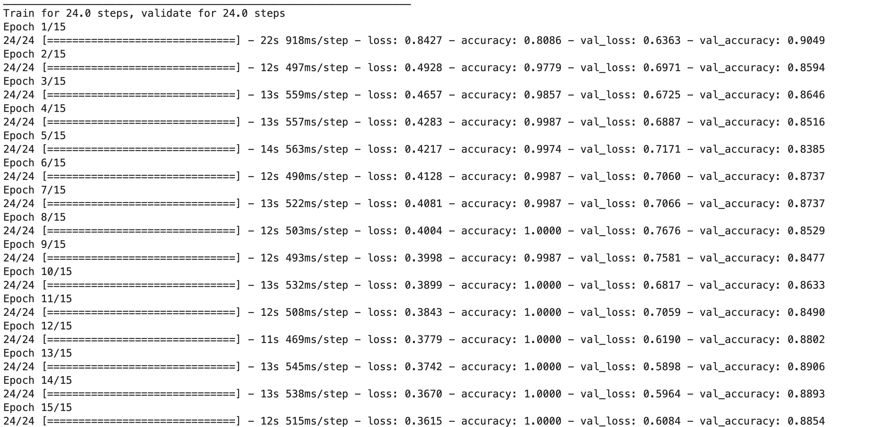
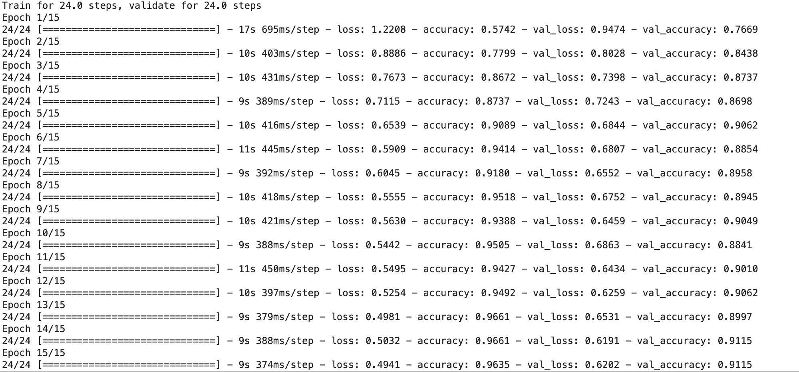
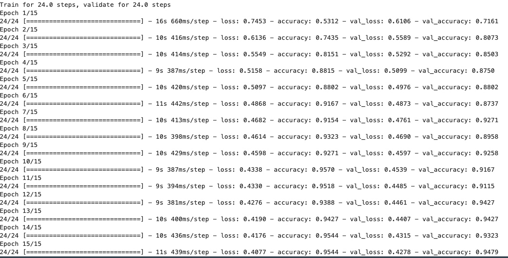

> 所属 Topic：[深度学习](../../topics/%E6%B7%B1%E5%BA%A6%E5%AD%A6%E4%B9%A0.md) · 类型：方法

# 【案例】

(1) 样本少容易过拟合

```
 base_model,
      tf.keras.layers.GlobalAveragePooling2D(),
      tf.keras.layers.Dropout(0.5),
      tf.keras.layers.Dense(256, kernel_regularizer=tf.keras.regularizers.l2(0.001),
                           activation='relu'),
      tf.keras.layers.Dense(2, activation = 'softmax')]
    )
```
加入正则化和dropout
进行图片增强产生更多图片

fine-tune效果



feature-效果



(2) 调整loss中的训练权重
class_weight = {0:0.75, 1:0.25}



QQ: 训练集和验证集效果都还好，但是到真实预测的时候效果却很差？？？
