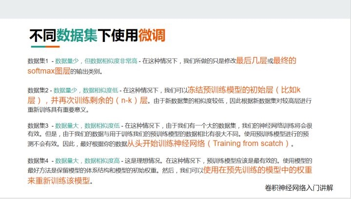

> 所属 Topic：[深度学习](../../topics/%E6%B7%B1%E5%BA%A6%E5%AD%A6%E4%B9%A0.md) · 类型：方法

# 训练数据少-

生成更多数据 https://juejin.im/post/5d887be951882509334fa199

数据量少的方法 https://zhuanlan.zhihu.com/p/50547038

1.迁移学习

（1）微调 https://zhuanlan.zhihu.com/p/35890660
利用已经训练好的模型和参数作为初始参数，再训模型

（2）特征提取（Feature Extraction） +特征融合（feature fusion）+ xgboost
模型结构不变，将最后输出部分的全连接特征取出

https://github.com/cameronfabbri/Compute-Features

过拟合
http://www.mashangxue123.com/tensorflow/tf2-tutorials-keras-overfit_and_underfit.html

* 权重正则化L1,L2
* dropout