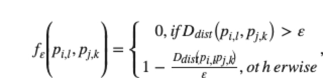

> 所属 Topic：[轨迹分析](../../topics/%E8%BD%A8%E8%BF%B9%E5%88%86%E6%9E%90.md) · 类型：方法

# CATS

首先定义两条曲线，各自上面两点之间的一个空间衰减函数。

简单地说就是，当两个的距离大于某个阈值e时候是0，当小于e时候。距离越近值越大，最终是个0-1上的值。

http://www.opticsjournal.net/richHtml/lop/2019/56/15/151002.html

