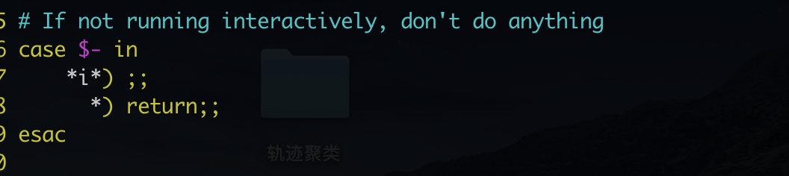

> 所属 Topic：[数据科学工作流](../../topics/%E6%95%B0%E6%8D%AE%E7%A7%91%E5%AD%A6%E5%B7%A5%E4%BD%9C%E6%B5%81.md) · 类型：工具

# crontab 

查看crontab的log日志

https://www.cnblogs.com/doseoer/p/5663187.html


查看其他用户的任务
```
crontab -u xxx -l
```


# python-cron设置相关

https://zhuanlan.zhihu.com/p/92152648


将脚本设置例行，加上`source ~/.bashrc`,发现并没有引入环境。原因



bashrc文件中有这个一句

解决方法：

直接注释掉.bashrc中的几行代码。这样做，之后所有的crontab任务都可以直接使用source来获取.bashrc中设置的环境变量，但是可能会对其他地方的产生影响，毕竟.bashrc中设置的环境变量可能会覆盖掉其他的环境变量；
可以在crontab执行的脚本中，手动设置交互式方式选项为打开状态，如下所示。不过这种方式只对当前脚本有效。

```
#! /bin/bash
set -i
source ~/.bashrc
```

参考链接 https://blog.csdn.net/skyyws/article/details/77769454


## BlockingScheduler
https://www.jianshu.com/p/ad2c42245906