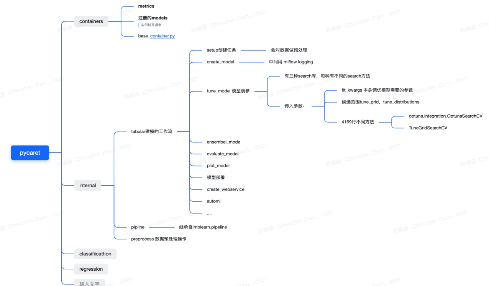

> 所属 Topic：[机器学习](../../topics/%E6%9C%BA%E5%99%A8%E5%AD%A6%E4%B9%A0.md) · 类型：工具

# pycaret





tune_model
https://github.com/ray-project/tune-sklearn
可以替换sklearn里的GridSerchCV和RandomizedSearchCV的方法，速度更快一些

```python
 search_library: str, default = 'scikit-learn'
        The search library used to tune hyperparameters.
        Possible values:

        - 'scikit-learn' - default, requires no further installation
        - 'scikit-optimize' - scikit-optimize. ``pip install scikit-optimize`` https://scikit-optimize.github.io/stable/
        - 'tune-sklearn' - Ray Tune scikit API. Does not support GPU models.
          ``pip install tune-sklearn ray[tune]`` https://github.com/ray-project/tune-sklearn
        - 'optuna' - Optuna. ``pip install optuna`` https://optuna.org/

    search_algorithm: str, default = None
        The search algorithm to be used for finding the best hyperparameters.
        Selection of search algorithms depends on the search_library parameter.
        Some search algorithms require additional libraries to be installed.
        If None, will use search library-specific default algorith.
        'scikit-learn' possible values:

        - 'random' - random grid search (default)
        - 'grid' - grid search

        'scikit-optimize' possible values:

        - 'bayesian' - Bayesian search (default)

        'tune-sklearn' possible values:

        - 'random' - random grid search (default)
        - 'grid' - grid search
        - 'bayesian' - Bayesian search using scikit-optimize
          ``pip install scikit-optimize``
        - 'hyperopt' - Tree-structured Parzen Estimator search using Hyperopt 
          ``pip install hyperopt``
        - 'bohb' - Bayesian search using HpBandSter 
          ``pip install hpbandster ConfigSpace``

        'optuna' possible values:

        - 'random' - randomized search
        - 'tpe' - Tree-structured Parzen Estimator search (default)
```
