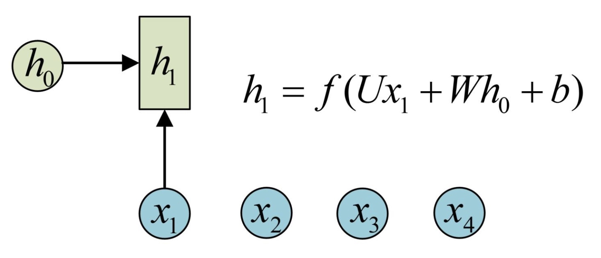
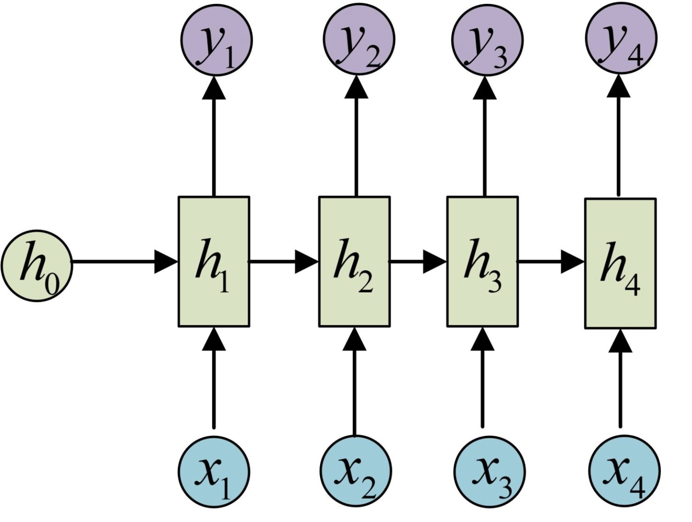

> 所属 Topic：[深度学习](../%E6%B7%B1%E5%BA%A6%E5%AD%A6%E4%B9%A0.md) · 类型：专题资料

# 【综述】

为了处理序列数据，rnn引入了隐藏状态hidden state的概念。如下图所示

说明: x1,x2,...代表时间序列上不同时刻的向量，在x1时刻，当前的隐状态h0和当前的输入x1，进行叠加得到了新的隐状态h1.以此类推。

而最终输出就是在隐状态h的基础上再进行一次计算。最终输出如下。这样就完成了序列输入(x1,x2,....xn),输出(y1, y2 ....yn)的过程

实际中按照输入和输出的变量个数可以有如下的一些情形：

* N vs 1
* 

## 参考
https://zhuanlan.zhihu.com/p/28054589